# The H.U.G. Protocol

## The digital home of the subversive Text Adventure Game.

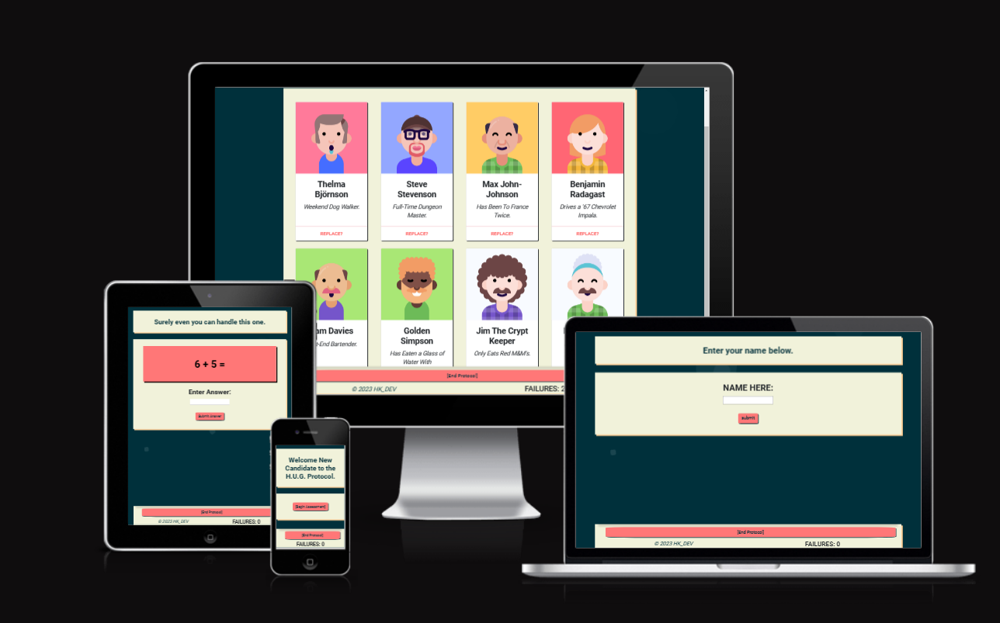

**Developer Links:**

*(Right-click to open in a new tab/window)*

[Developer - HK_Dev](https://github.com/Hadokane "Hadokane - Github")

[Commit Log](https://github.com/Hadokane/CI_PP2_HUG/commits/main)

**Live Website Link:**

[Live Website](https://hadokane.github.io/CI_PP2_HUG/ "H.U.G. Protocol")

**Repository Pages:**

[Repository page - index.html](https://github.com/Hadokane/CI_PP2_HUG/blob/main/index.html#L3)

[Repository page - style.css](https://github.com/Hadokane/CI_PP2_HUG/blob/main/assets/css/style.css)

[Repository page - scripts.js](https://github.com/Hadokane/CI_PP2_HUG/blob/main/assets/js/scripts.js)

---
## Academic Project Aims
---

I am currently pursuing my **Diploma in Web App Development** from [Code Institute](https://codeinstitute.net/ "code Institute").

The academic aim of this project is to demonstrate my newly developed skills within Javascript by building an interactive front-end site.
It will be responsive to users actions, allowing them to engage with the presented data, elements and imagery to progress through an engaging "text-adventure" game and reach a satisfying conclusion.

The user will be able to interact with the games many elements in order to reach the satisfying conclusion of passing the "H.U.G. Protocol."

As the site owner I will achieve my goal of providing an engaging and fast to digest "Text-Adventure" game for multiple users to enjoy.

I intend to display the above throughout the project via my: coding, comments, commits, and the explanation provided by this README file.

Additional functionality has been provided by the framework [Bootstrap 4.6](https://getbootstrap.com/docs/4.6/getting-started/introduction/) & [jQuery 3.6.1](https://jquery.com/download/).

Great care has been taken, to ensure that the website is designed to meet best practice standards, and is responsive on all screen resolutions.

It has been tested on a variety of devices and screen resolutions: from mobiles; to tablets; and 4k-monitors. It also has proven compatibility with all popular web browsers.

---
## Table of Contents
---

1. [User Experience (UX)](#user-experience---ux)
    - [Strategy Plane](#strategy-plane)
        - [User Stories](#user-stories)
    - [Scope Plane](#scope-plane)
    - [Structure Plane](#structure-plane)
        - [Interaction Design (IXD)](#interaction-design---ixd)
    - [Skeleton Plane](#skeleton-plane)
        - [Wireframes](#wireframes)
    - [Surface Plane](#surface-plane)
1. [Validation Tests](#validation)
    - [HTML Validation](#html-validation)
    - [CSS Validation](#css-validation)
    - [Javascript Validation](#javascript-validation)
1. [Testing](#testing)
    - [Screen Reader Accessibility](#screen-reader-accessibility)
    - [Performance Testing](#performance-testing)
    - [Device Testing](#device-testing)
1. [Manual & User Testing](#manual-&-user-testing)
    - [Meeting User Stories](#meeting-user-goals)
    - [User Feedback](#user-feedback)
    - [Chrome Dev Tools](#chrome-dev-tools)
1. [Bug Fixes](#bug-fixes)
1. [Deployment](#deployment)
    - [Forking](#forking)
1. [Credits](#credits)
    - [Languages Used](#languages-used)
    - [Frameworks Used](#frameworks-used)
    - [Validators Used](#validators-used)
    - [Technologies Used](#technologies-used)
    - [Acknowledgements](#acknowledgements)

---
## User Experience - UX
---

I have arranged my UX analysis in the style of Jesse James Garrett's philosophy of the "5 Planes" framework - as discussed in his book [The Elements of User Experience](https://www.amazon.co.uk/Elements-User-Experience-User-Centered-Design/dp/0321683684/ref=asc_df_0321683684/?tag=googshopuk-21&linkCode=df0&hvadid=311000051962&hvpos=&hvnetw=g&hvrand=10376246921916888236&hvpone=&hvptwo=&hvqmt=&hvdev=c&hvdvcmdl=&hvlocint=&hvlocphy=1007448&hvtargid=pla-432330338546&psc=1&th=1&psc=1).

I decided to utilise this methodology in order to establish achievable goals for my project, meeting the needs of both the user (or player) and site owner (or developer).

I will maintain a clear, justified development path, and establish a defined priority of tasks and elements for integration. Ensuring the project avoids "feature creep," at this development stage, maintaining its initial scope.

---
### Strategy Plane
---

The following user stories have been numbered sequentially so that they may be referenced in later sections.

For example: 

    (User stories met: 1-1, 2-3, 5-1)

Would show that:

    User Stories: #1-1; #2-3;
    Site Owner Stories: #5-1;

Had been met by the stated example.

Each subheading provided expands upon the initial goal, providing further elaboration on ways to achieve it or referencing areas where I expect to meet these goals throughout the development of the project.

**User/Player Stories:**

As a site user/game player, I want to:

1. Be able to interact with the elements of the game and reach a desired result:

    1. Do the buttons work and direct you to an expected place?

    2. Can I enter a name in the `nameBox input` field and have it be displayed correctly throughout the project?

    3. Does the maths answer box accept my answer and tell me if it's correct or incorrect?

    4. Do the options provided in the text-adventure section lead to logical areas?

2. Reach a satisfying conclusion:

    1. Provide users with their own unique membership card.

    2. Grant users the ability to "recruit" others. Making them feel as if they've achieved true membership within the H.U.G. protocol.

3. Have a reason to replay the game:

    1. Is the user greeted with a different experience each time they play? If so how?
        
        1. through the use of randomly generated math questions
        
        2. through the use of randomly generated user cards
        
        3. different routes are available through the "Text-based" obstacle course section.

**Site Owner/Developer Stories:**

As a site owner, I want to:

4. Ensure the app works as intended for the user.

5. Ensure the user/player can interact with all elements to reach a logical and desired result.

    1. This goal will be achieved naturally by achieving all of the standards laid out within "User story" (1).
    
    2. Manual testing of the site's many paths and elements will be crucial to achieving both this goal and the aforementioned user goal, and as such will be documented in its own section later.

6. Ensure the app and it's elements display correctly on any device.

    1. Check it on multiple devices and screen sizes. (Documented in the testing section and improved upon by user feedback).

    2. Are all elements can be interacted with by mouse and touch devices? (Include photos of using a each device, before and after).

7. Demonstrate a variety of javascript functionality such as:

    1. "onClick" functions. (Button events).

    2. "promise" functions. (Sleep function).

    3. "if" loops. (To cycle through arrays and generate cards.)
    
    4. Arrays. (Members array stores data for card generation.)

8. Provide a unique experience for each individual user/player.
    
    1. This goal ties into "user story" (3) of achieving "replayability".
    
    2. We can achieve both through the use of random cards and "branching" pathways in the text adventure section.

**Grid Of Opportunities - To Meet User Expectations:**

With the above goals in mind, I have assembled the following "grid of opportunities" to showcase what features to prioritise heading into the next stage of development.

| Opportunity                        | IMPORTANCE | VIABILITY |
|------------------------------------|------------|-----------|
| All elements function correctly    | 5          | 5         |
| Reach a satisfying conclusion      | 5          | 5         |
| Provide variety with Javascript interaction | 4          | 4        |
| Replayability for players          | 3          | 3         |

[Back to top ↑](#the-hug-protocol)

---

### Scope Plane 
---

It is within this plane that I will address, the features required to meet the established by the "User Stories" section of the Strategy Plane. These goals will allow me to avoid "feature creep" and maintain an agile approach to the development of the website.


---
## Validation
---

With all user stories being satisfactorily met, the website being published and user-testing fixes implemented, I then ran the site through several online Validators to confirm it meets best practices and runs as efficiently as possible.

---
### HTML Validation
---

I began my validation by running the HTML page through "[W3C's Validation Service](https://validator.w3.org/)."

**Initial validation**

<details><summary>HTML Test</summary>
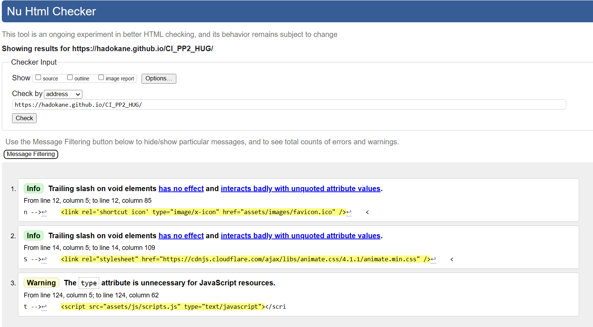
</details>

The errors found can be summarised as follows:
- Unnecessary /> closing tags on a few HTML Head links.
- An unnecessary type attribute had been included where i'd linked to my Javascript at the end of the HTML's body.

**Validation Passes**

I fixed the above issues and ran the pages back through W3C's validation services. 

<details><summary>HTML Pass</summary>
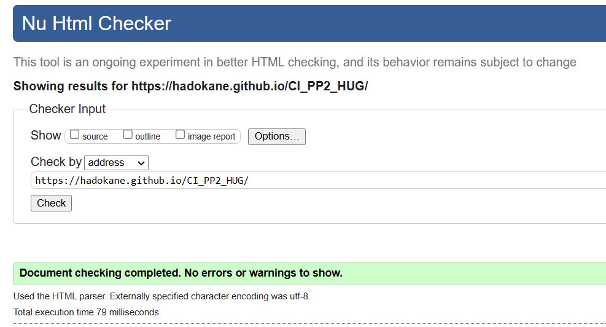
</details>

---
### CSS Validation
---

Next I carried out validation on the project's CSS file by running the page through "[W3C CSS Validation Service](https://jigsaw.w3.org/css-validator/)."

<details><summary>CSS Pass</summary>
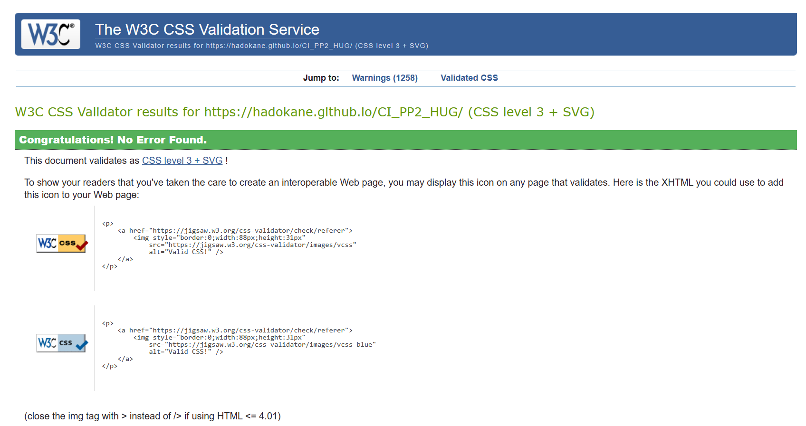</details>

The results came back successfully, allowing me to continue automated testing and validation.

---
### Javascript Validation
---

Finally it was time to run the largest, most integral file of this project - scripts.js - through "[JSLint](https://www.jslint.com/)."

**Initial validation**

<details><summary>Javascript Test (A)</summary>
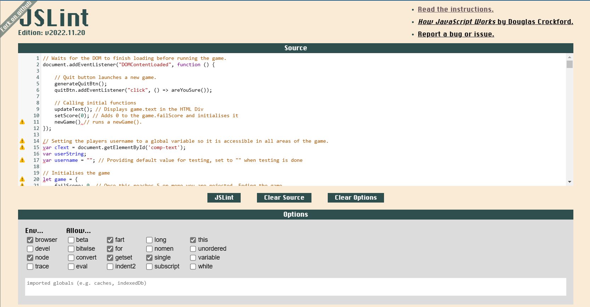
</details>

<details><summary>Javascript Test (B)</summary>
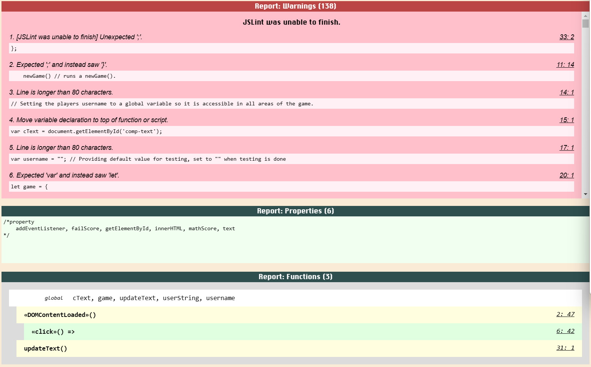
</details>

I was initially horrified to see there were "138" warnings present. I poured a strong coffee and prepared for a long night... until i realised that I had mistakenly not clicked a few necessary options in JSLint.

Thankfully it turned out that the bulk of these warning (legitimately around ~133) were to do entirely with the following things:
- Unnecessary whitespace after comments.
- Comments running over 80 characters.

Ticking the options for "long" and "white" in the linters options, immediately cleared the bulk of these. Although I still did remove all unnecessary whitespace manually before moving onto the more realistic improvements offered, such as:
- Moving global variables to the top of the document.
- Changing a few "let" globals into "var" globals.

**Validation Passes**

After these quick changes, I re-ran the code and received the following result.

<details><summary>Javascript Pass</summary>
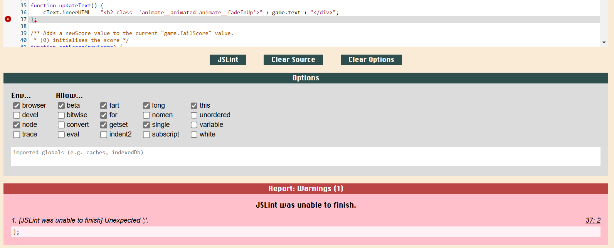
</details>

I opted to leave in the ";" at the end of my functions as an added precaution. My additional reading on the subject suggested that most developers are perfectly content to have them included in a project and they will in no way negatively impact the results of the site.

[Back to top ↑](#the-hug-protocol)

---
## Testing
---

### Wave Contrast & Accessibility
---

Next I ran the site through [WAVE's Accessibility Evaluator](https://wave.webaim.org/) to test for any issues with contrast or accessibility that may impede the users enjoyment of the game.

**Initial Test**

<details><summary>Wave Test</summary>
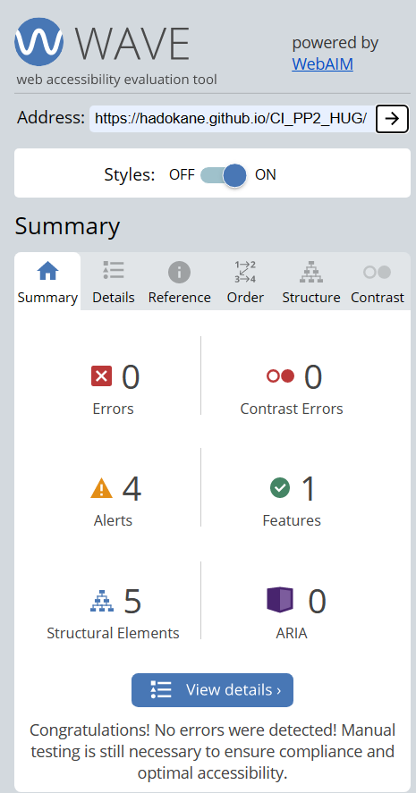</details>

<details><summary>Wave Contrast Test</summary>
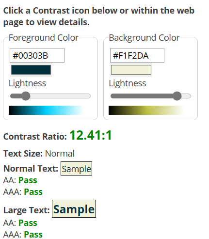</details>

Wave returned favourable results in reference to my chosen colour palette. Ensuring all the text being displayed to the user will be visible and positively impact their experience while playing the game.

The only suggested improvement was to include a `<h1>` and `<h3>` tags as the page technically skips these on the initial screen.

As the game loads in and out text constantly and doesn't I didn't feel it was apt to set this as a `<h1>` tag as their is no "Title" present on the page at any point during a game session.

The `<h3>` tags also populate the game later on and are featured within the generated cards, meaning that at point in the game there are no structural issues. This seems worth noting and in future improvements I may consider adding in an introductory screen that can include these elements permanently. 

---
### Performance Testing
---

Google Lighthouse - a feature of Chrome Developer Tools - allows me to test the overall performance of the page on both mobile and desktop devices.

- It reminded me to add `<meta>` descriptions to my index head.

Featured below are the screenshots confirming my results:

**Desktop**

<details><summary>Lighthouse Results</summary>
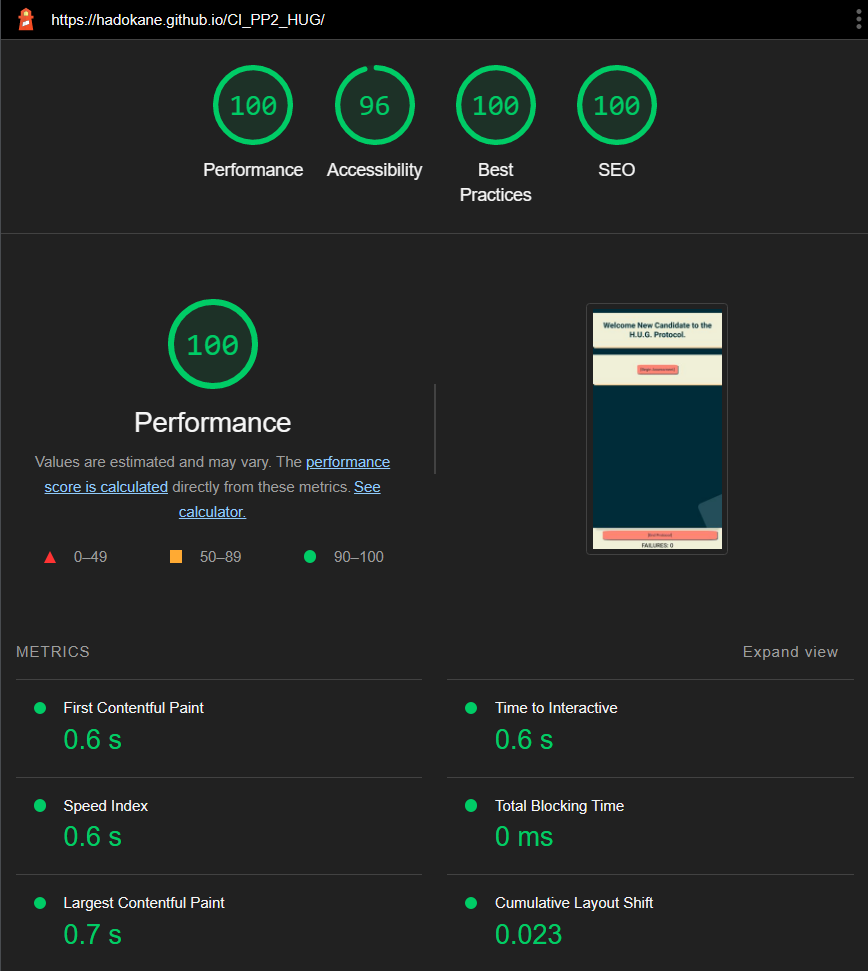</details>

---

**Mobile**

<details><summary>Lighthouse Index Mobile Results</summary>
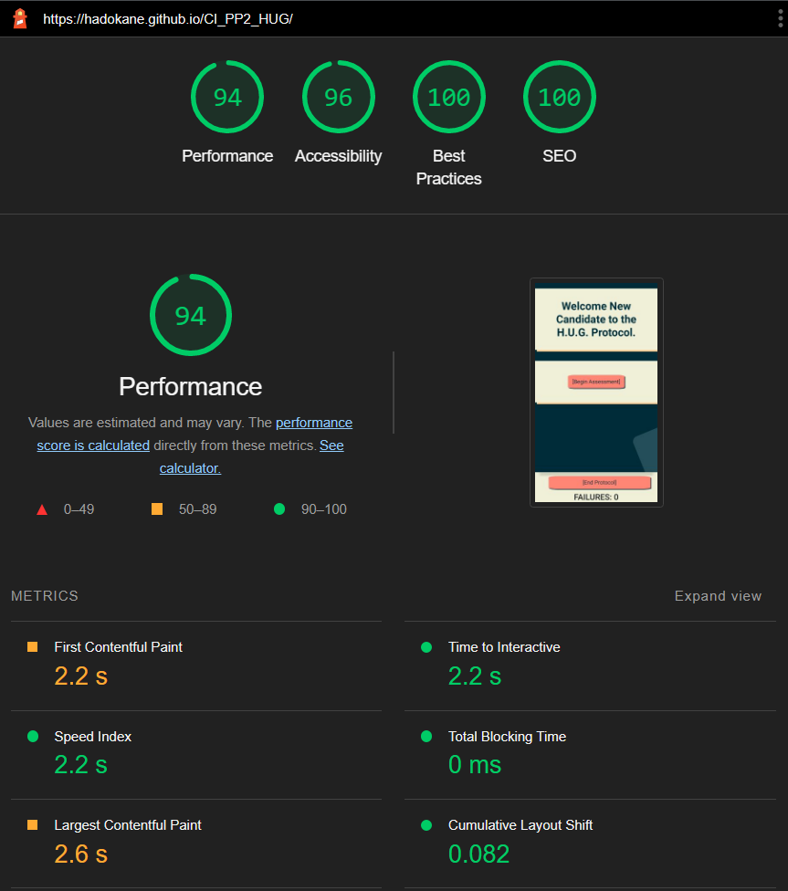</details>

---
### Device Testing
---

The website was tested and functioned as expected on the following devices:

- Novatech LTD. AMD Ryzen 7 3800x, 32GB Desktop
- Lenovo IdeaPad 5 Pro
- Samsung Galaxy S20 & S21
- Samsung Galaxy Tab S7
- MacBook Air with M1 chip
- iPhone 11, 13 & 14
- iPad Air
- Samsung Chrome Book

The website has been tested on up-to-date versions of the following browsers:

- Microsoft Edge
- Google Chrome
- Chrome for android
- Mozilla Firefox
- Opera
- Safari
- Internet Explorer

The website has also been tested on monitors of 16:9, 16:10 and 21:9 resolutions.

---
## Manual & User Testing
---

Manual testing played a crucial role in the development of this game. It was present at nearly every step of development with me tracking how each function worked and interconnected - by text document or pen and paper - to ensure their would be no dead ends that effected the users experience and defined goals.

Once the project had reached completion I compiled a list of my main concerns for running play-testing.

The following would need to all be checked thoroughly and work without error, in order for me to feel i'd met my previously outlined Site Owner Goals. 

The following would need to be tested to ensure i'd satisfied my brief and provided a fully functional game, fit for consumption by the user:

- Can the game be finished?
- Will using non-standard letters break the user-name input?
- - Can you still finish the game like this?
- Does "GAME OVER" trigger correctly?
- - Can you trigger a "GAME OVER" from each question within the Maths section?
- - Can you trigger a "GAME OVER" from each bad answer in the Obstacle Course Section?
- Do different "members" appear each time this screen is reached by the player?
- - Are their first names, last names and skills different enough on each reload?
- Does the players end card display?
- - Does their score match their failures?
- Do the math questions accept the correct answers?
- - Do they correctly update to, and display, the next operand?
- Do the correct options display in the Obstacle course section based on the `state{}`?
- - Does keeping a state such as `"rock: true" or "rope:true"` effect the game when kept longer than intended?
- - Can you still finish the game with these set to `true`? 

With so many branching story paths, potential areas to game over.

---
### User Feedback
---

1 - Empty the Maths Answer Box when the question is answered, rather than the previous answer remaining until the user manually deletes it. Vastly improves the experience.

2 - Fix error where the end card was displaying incorrectly - and very squashed - on small screen mobile devices. Fixed with bootstrap code and by removing the ".build" class which set the card to 40% of the container... didn't factor in the container was smaller on smaller devices and therefore the card wouldn't maintain it's shape - as seen in the below example - when shrunk far enough.

---
### Chrome Dev Tools
---

Chrome Dev Tools served as one of my most important methods of debugging from start to finish. It allowed me to find numerous errors in the code such as: 
- noticing discrepancies in my `<div>` arrangements and classes that affected the styles and overall final alignment of generated elements such as the members cards.
- test out inline style's on numerous elements before typing those up in CSS or Javascript for use.
- see if an object had unintentional padding or margins being applied to it by Bootstrap or other external classes.
- diagnose numerous bugs and hierarchical code issues present throughout the project.
- use the "issues" tab to see any other ongoing problems that - even if not preventing the game from running - may not meet best practice guidelines.

<details><summary>Chrome Dev Tools #1</summary>
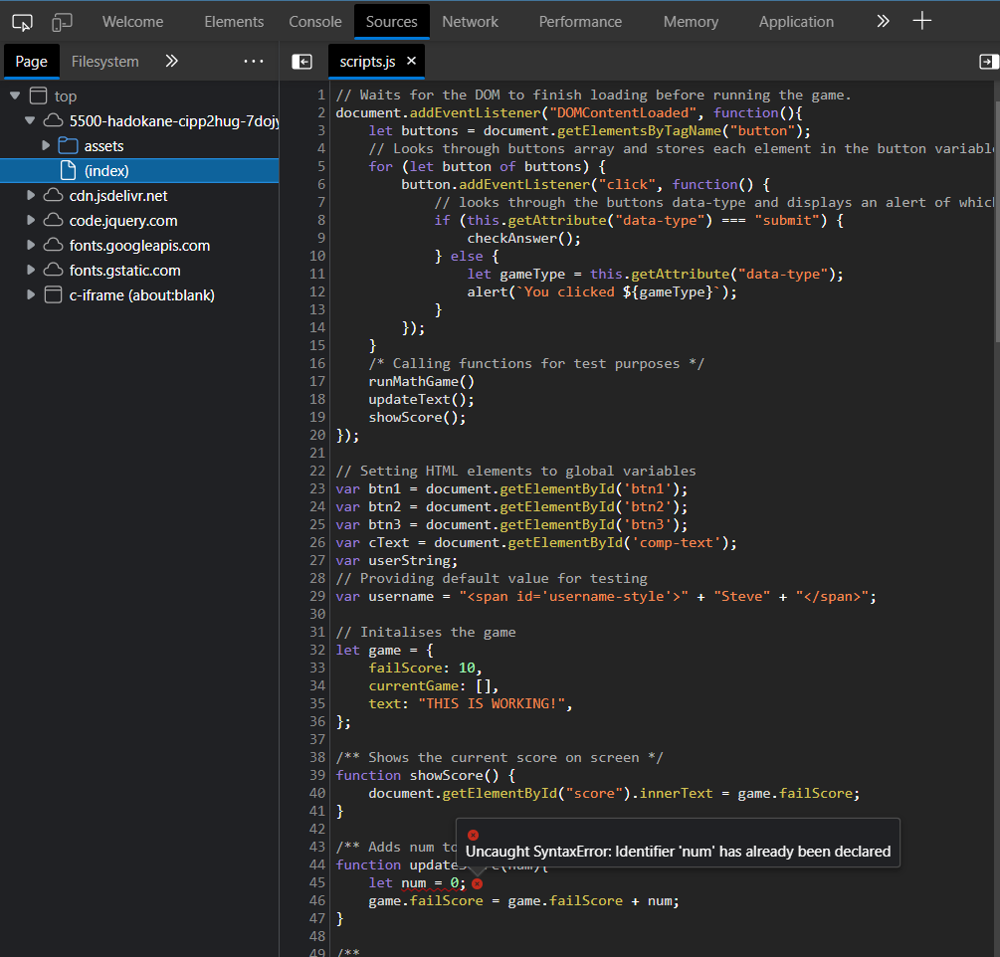</details>

<details><summary>Chrome Dev Tools #2</summary>
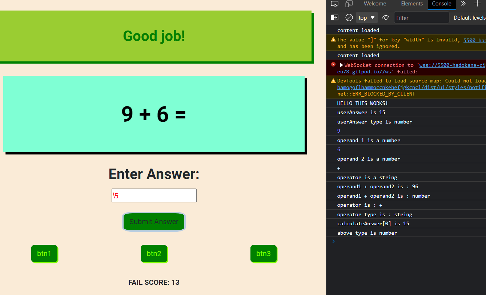</details>

<details><summary>Chrome Dev Tools #3</summary>
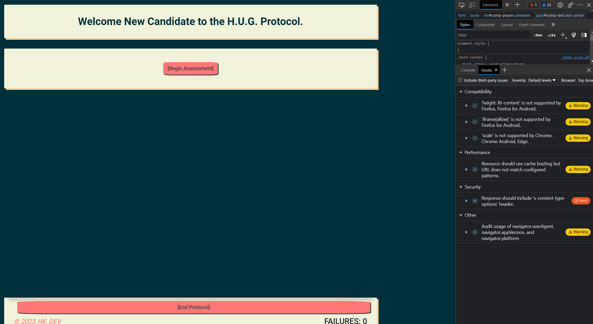</details>

This is detailed further throughout the below Bug Fixes section (#4, #6, #7 - serving as prime examples.)

[Back to top ↑](#The-H.U.G.-Protocol)

---
## Bug Fixes
---

The following is a documentation of the bugs encountered throughout the development process of this "Text Adventure" Game.

---

**BUG #1**

---

The computer player's text would update to the last line automatically before the user was given the chance to see the previous lines. 
<details><summary>Bug #1-1</summary>
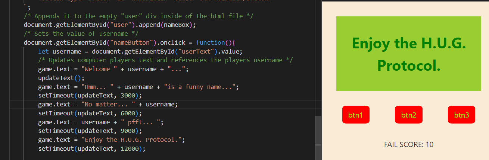</details>
This happened because functions don't happen asynchronously by default.

My solution was found online in a [Sitepoint article](https://www.sitepoint.com/delay-sleep-pause-wait/) which showed me I could use an async promise function to create a reusable automated delay between text updates.
<details><summary>Bug #1-2</summary>
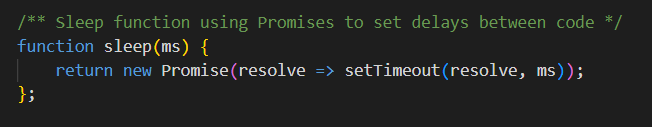</details>

This allowed me to achieve my vision of providing an automated AI computer to act as the player's guide throughout the game.
<details><summary>Bug #1-3</summary>
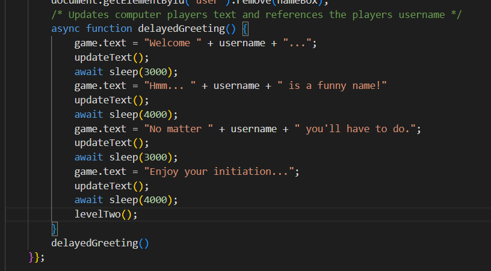</details>

---

**BUG #2**

---

I wanted to be able to style the player's username to differentiate it from the computer player's text.

By passing the "userText" value, I found I was unable to remotely change it.
<details><summary>Bug #2-1</summary>
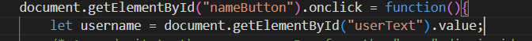</details>
The solution I engineered was to change the:

```
cText.innerText = game.text;
into 
cText.innerHTML = game.text;
```
By changing the above to `.innerHTML` I was able to provide classes and styling to the username value without having to worry about altering the surrounding text.
<details><summary>Bug #2-2</summary>
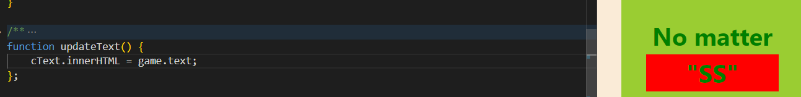</details>

---

**BUG #3**

---

I tried following an online tutorial - [Youtube: developedbyed](https://www.youtube.com/watch?v=GUEB9FogoP8) - to separate the characters within "game.text" to get them to animate individually.
<details><summary>Bug #3</summary>
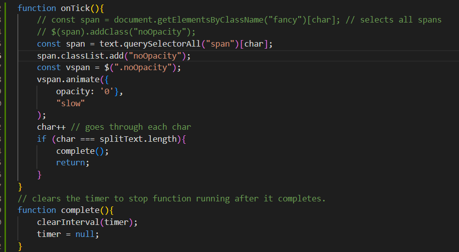</details>

The following lines of code didn't work as expected and the text simply animated on as normal.

```
cont span = document.getElementsByClassName("fancy")[char];
$(span).addClass("noOpacity");
```
I eventually decided to simply use the "Animate.css" plugin to animate the text in a satisfying manner.

This is something I would look at reintroducing in a future version of the game.
At this stage however, it wasn't a core feature for the user experience and was cut from this stage of development.

---

**BUG #4**

---

Answers input into the "Maths" game section were being flagged as incorrect, even when correct.

<details><summary>Bug #4-1</summary>
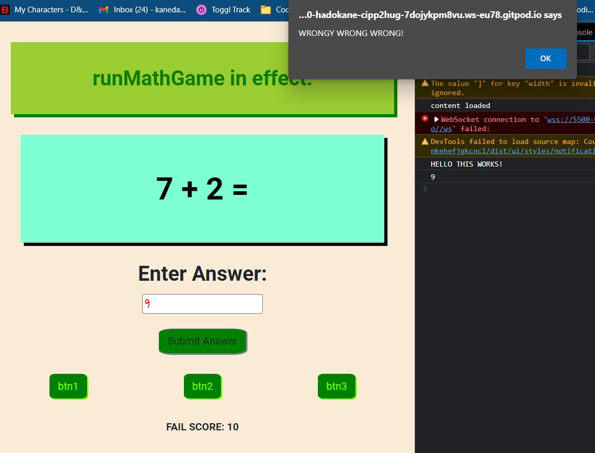</details>

To investigate this further I utilised Chrome Dev Tools.

I began by console logging out the values and data types of the random numbers being generated for the math equations, the operand used and the user's answer.

<details><summary>Bug #4-2</summary>
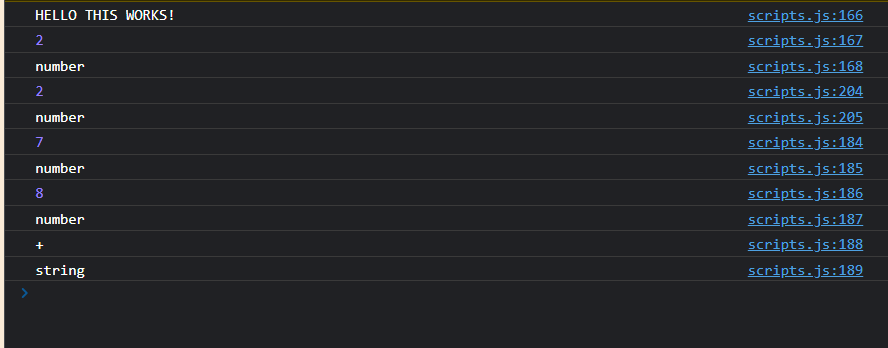</details>

This allowed me to uncover that I had been comparing a number to a string value using `===` which would return a false answer even when the values matched. 

As a "9" number isn't equivalent to a "9" that is a string.

<details><summary>Bug #4-3</summary>
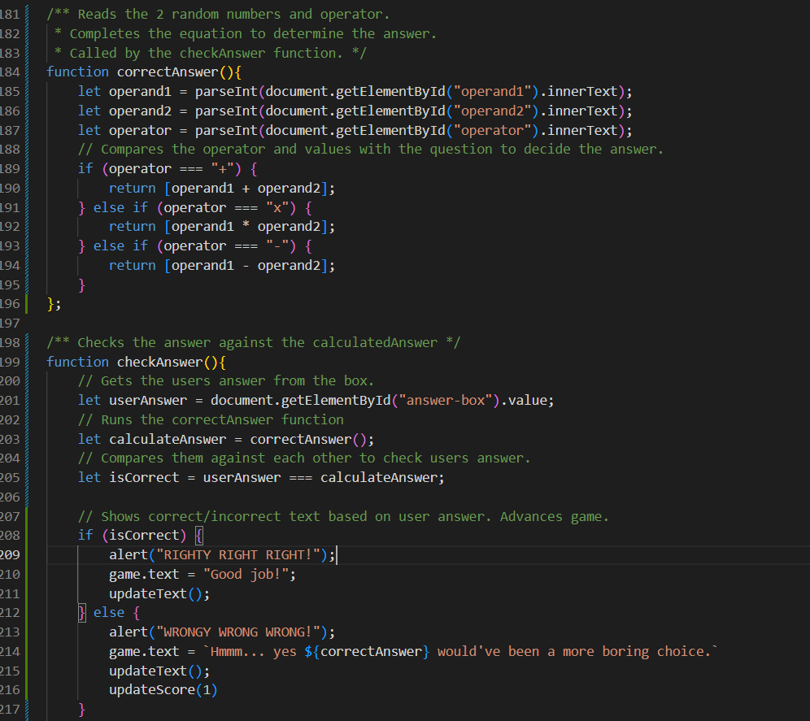</details>

Removing the `parseINT()` from around the following:

```
let operator = parseInt(document.getElementById(operator));
```

This caused the operator to return the correct type of data, allowing the equation to return true when the correct answer was input.

---

**BUG #5**

---

I designed the game's many different levels in individual segments and functions. This was to ensure they worked in isolation before joining them all together.

As I connected the new game launch button with the name input field, I encountered an error where the text box for the player to enter their chosen username wouldn't appear.

<details><summary>Bug #5-1 (BEFORE CLICK)</summary>
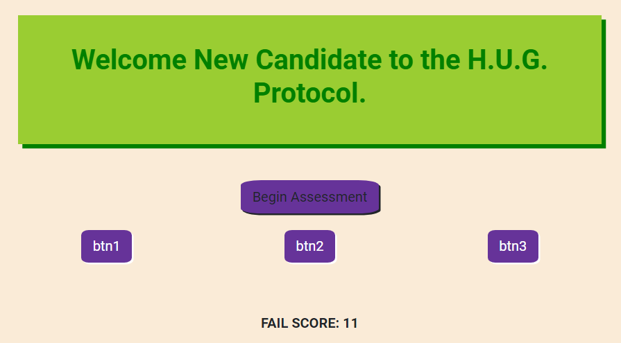</details>

<details><summary>Bug #5-2(AFTER CLICK)</summary>
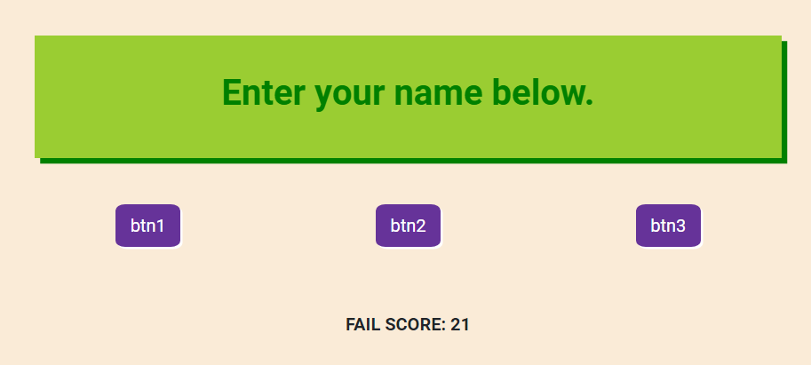</details>

After some analysis, I found this code to be the culprit.

<details><summary>Bug #5-3</summary>
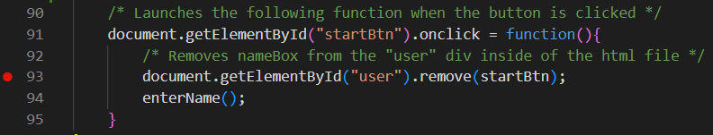</details>

Removing the new game button directly from the div itself, seemed to stop the amend that was called in the next function.

The solution in this instance was to instead remove the button directly.

<details><summary>Bug #5-4</summary>
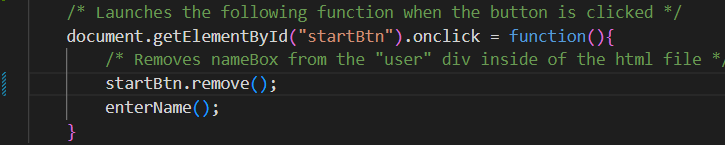</details>

---

**BUG #6**

---

Clicking the "nameBox" submit button, removed the entire div element it was inside of.

<details><summary>Bug #6-1 (BEFORE CLICK)</summary>
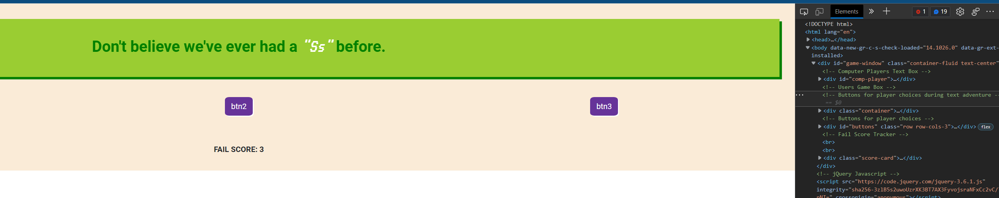</details>

<details><summary>Bug #6-2 (AFTER CLICK)</summary>
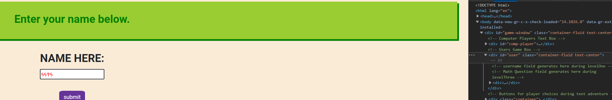</details>

This was caused by and resolved similarly to Bug #7.
The remove function called on "nameBox" was removing the entire "user" div, meaning the amend couldn't create the following object in its target div, as it had been deleted.

<details><summary>Bug #6-3</summary>
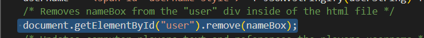</details>

The solution was to again simply remove the "nameBox" directly.

<details><summary>Bug #6-4</summary>
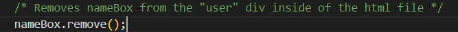</details>

---

**BUG #7**

---

The card generator array would stop splicing people from the "members" array. Occurring before the function had finished being called for the 8th time.

<details><summary>Bug #7-1</summary>
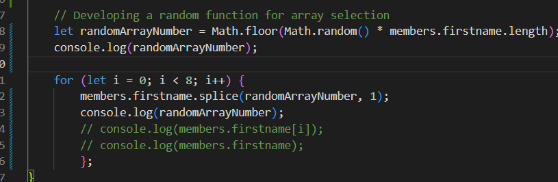</details>

It seemed randomised how many were created before the loop would stick to the same number and stop producing results.

<details><summary>Bug #7-2</summary>
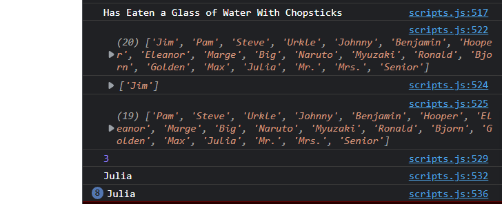</details>

The solution was to move the random number generator variables inside of the loop, as they weren't being called correctly when left as global variables.

<details><summary>Bug #7-3</summary>
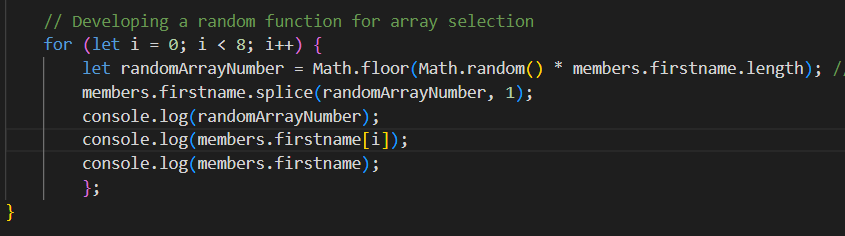</details>

---

**BUG #8**

---

A further issue with the array was when the cards wouldn't generate a random avatar image despite being - seemingly - correctly coded.

<details><summary>Bug #8-1</summary>
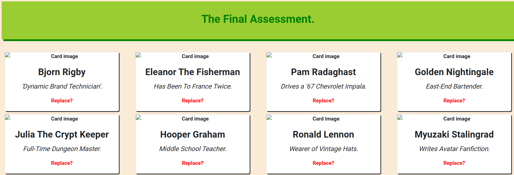</details>

I had forgotten to add the ".png" suffix to the end of my linked avatar images within the array.

After amending these suffixes the cards loaded as expected.

<details><summary>Bug #8-2</summary>
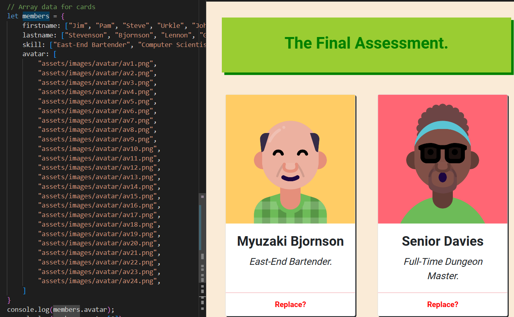</details>

---

**BUG #9**

---

Text animations weren't playing during the "HUB Text Adventure" portion of the game.

This caused a jarring experience for the user as the text would stop animating during this section only.

The issues lie in the code I had written to set the: 

```
cText.innerHTML = <h2>textNode.text</h2>
```

This seemed logical to me as the "cText" was the element being displayed, formatted and working correctly in other areas of the game.

However the code that got me the desired result was:

```
game.text = textNode.text;
updateText();
```

The animations themselves had been tied to the `updateText()` function, which was not being called with the original code.

This change fixed the bug and allowed the game to maintain its animations throughout, improving the user's experience by preventing a distracting change.

---

**BUG #10**

---

Originally had card set to `scale: 95%` in order to separate them vertically, as setting their bodies to `h-100` meant their was no gap between the tops and bottoms of each individual card. After passing this through stages of automated validation, I was advised to change the setting to `transform: scale(0.95)` in my CSS. This change didn't effect functionality but is a more correct way to write this style.

<details><summary>Bug #10-1</summary>
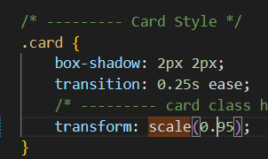</details>

[Back to top ↑](#The-H.U.G.-Protocol)

---
## Deployment
---

The website was deployed on GitHub via the following steps:

1. Login into GitHub and navigate to this repository - [CI_PP2_H.U.G.](https://github.com/Hadokane/CI_PP2_HUG)
    <details><summary>Deployment 1</summary>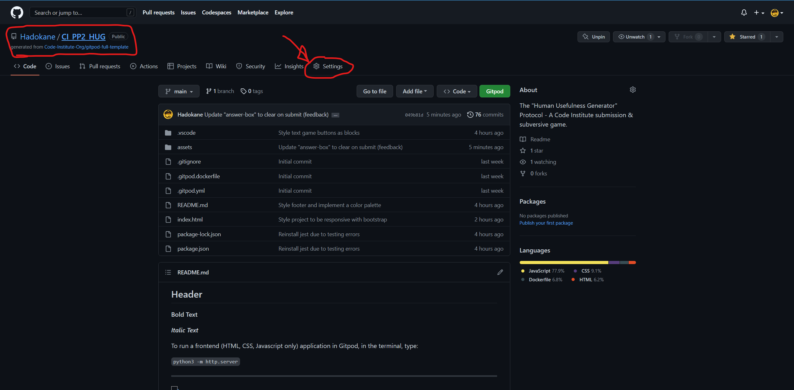</details>
2. Head to the "Settings" tab on the navigation menu and select it.
3. On the left sidebar select "Pages".
    <details><summary>Deployment 2</summary>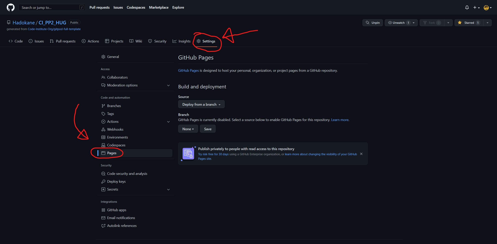</details>
4. Under "Build and deployment" you will see a heading names "Source". Click on the dropdown menu and select: "Branch: main" leaving the file as "/(root)"
5. Click the save button.
    <details><summary>Deployment 3</summary>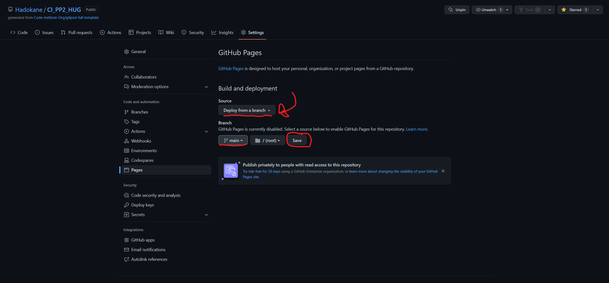</details>
6. A URL will appear in your newly deployed repository.
7. GitHub will process your request and the bar's colour will change from blue to green on a page refresh, indicating that the page has been deployed.
8. The website is now live and deployed at the following URL: https://hadokane.github.io/CI_PP2_HUG/

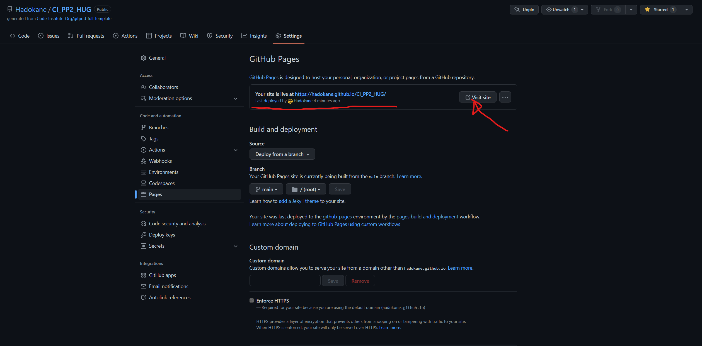

**Forking**
1. Login into GitHub and navigate to this repository - [CI_PP2_H.U.G.](https://github.com/Hadokane/CI_PP2_HUG)
2. Select the "Fork" tab on the right-hand side of the navigation menu.
3. Choose a destination to save your newly forked repository.

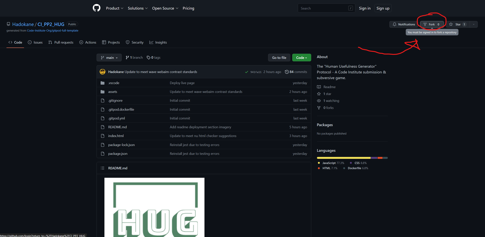

[Back to top ↑](#The-H.U.G.-Protocol)

---
## Credits 
---

### Languages Used

- HTML 5
- CSS 3
- Javascript ES2022

### Frameworks Used 

- [Bootstrap 4](https://getbootstrap.com/docs/4.6/getting-started/introduction/) - For their responsive grid and container system.
- [jQuery](https://jquery.com/download/) - For their convenient JavaScript library features.
- [Animate.css](https://animate.style/) - For their simple to use CSS animations.

### Validators Used 

- [W3C HTML Validator](https://validator.w3.org/) - Validation of HTML.
- [W3C JigSaw Validator](https://jigsaw.w3.org/css-validator/) - Validation of CSS.
- [JSLint Validator](https://www.jslint.com/) - Validation of Javascript.
- [Webaim](https://wave.webaim.org/) - Accessibility Testing.
- [Lighthouse & Chrome DevTools](https://developer.chrome.com/docs/devtools/) - Performance testing.

### Technologies Used

1. [CI TEMPLATE](https://github.com/Code-Institute-Org/gitpod-full-template) - This repository was initially created using Code Institute's provided template.

2. [Markdown Guide](https://www.markdownguide.org/cheat-sheet/) - For their "Markdown Cheat Sheet" and assistive documents on writing a README.md file.

3. [Grammarly](https://app.grammarly.com/) - For spell-checking my Text Based Adventure Module during brainstorming.

4. [Am I Responsive](https://ui.dev/amiresponsive) - For providing the mock-up image featured at the top of this document.

5. [Google Fonts](https://fonts.google.com/) - For access to their wealth of commercially-available fonts.

6. [Favicon.io](https://favicon.io/) - For providing an emoji based favicon for use in this game.

7. [Balsamiq](https://balsamiq.com/) - For providing software to create the wireframes seen in this README.

8. [GitHub](https://github.com/) - For serving as my IDE of choice and allowing me to create and deploy my repository for user testing and submission purposes.

9. [StackOverflow Question](https://stackoverflow.com/questions/11813806/javascript-get-a-functions-variables-value-within-another-function) - For advice on making functions global. Used when deciding if username variables should be made global for later content to access the value.

10. [FreeCodeCamp Article](https://www.freecodecamp.org/news/var-let-and-const-whats-the-difference/) - For a convenient primer on the differences between "Var" "Let" and "Const". Used when checking over my variables to ensure correct choices had been made.

11. [Sitepoint Article](https://www.sitepoint.com/delay-sleep-pause-wait/) - Explained the premise of a "sleep" function and the use of promises to stagger my code for the automated computer player box I implemented throughout the project. This allowed for the integration of a more user friendly experience by reducing the number of button presses required to progress for the user. Creating the illusion of a sentient AI presence.

12. [Youtube: developedbyed](https://www.youtube.com/watch?v=GUEB9FogoP8) - Great tutorial on text animations. Didn't end up implementing as used Animate.css instead but serves as good reference for potential future updates.

13. [CodeBoxx Article](https://code-boxx.com/allow-one-click-javascript/) - For reference when deciding to disable the "maths-box" submit button onClick to prevent multiple answer submissions. Could cause the score to bug out or the player to accidentally fail the game.

14. [MDN Webdocks](https://developer.mozilla.org/en-US/docs/Web/API/EventTarget/removeEventListener) - Provided general Javascript advice and reminders on functionality. Namely pertaining to event listeners and DOM targetting/navigation.

15. [Personas](https://personas.draftbit.com/) - Avatar generator used to provide images for the cards generated by the "members" array.

16. [Animate.css](https://animate.style/) - Animation plug-in used for text update animation.

17. [w3Schools](https://www.w3schools.com/) - Use for general HTML, CSS & Javascript research and referencing.

18. [CodePen Article](https://codepen.io/gunnarbittersmann/pen/XpqmgJ?editors=0100) - Provided a reference example of an image fading to grey. Used as reference when creating my own "Fade Out" Animation for the "sacrifice" Card.

19. [Valve: Left4Dead](https://www.youtube.com/watch?v=O8IJepb-hlQ) - Death sounds sampled to make the "destroy" card audio heard at the end of this game.

20. [DEV](https://dev.to/javascript_jeep/how-to-empty-the-dom-element-in-javascript-nf8)- Used to understand the best method to empty a div in Javascript.

21. [Lospec: AYY4 PALETTE](https://lospec.com/palette-list/ayy4) - Color palette I used for this project.

22. [SpeckyBoy](https://speckyboy.com/css-javascript-animated-backgrounds) - Animated background in project taken directly from here.

---
## Acknowledgements
---

With thanks to:
- My family and friends - For providing some great feedback and user-testing across multiple devices and browsers.

- Code Institute & their wider "Slack" community - For providing me with the necessary skills, knowledge and guidance to execute this project.

[Back to top ↑](#The-H.U.G.-Protocol)

---