# The H.U.G. Protocol

## The digital home of the Subversive Text Adventure Game.


**Developer Links:**

*(Right-click to open in a new tab/window)*

[Developer - HK_Dev](https://github.com/Hadokane "Hadokane - Github")

[Commit Log](https://github.com/Hadokane/CI_PP2_HUG/commits/main)

**Live Website Link:**

[Live Website](https://hadokane.github.io/CI_PP2_HUG/ "H.U.G. Protocol")

**Repository Pages:**

[Repository page - index.html](https://github.com/Hadokane/CI_PP2_HUG/blob/main/index.html#L3)

[Repository page - style.css](https://github.com/Hadokane/CI_PP2_HUG/blob/main/assets/css/style.css)

[Repository page - scripts.js](https://github.com/Hadokane/CI_PP2_HUG/blob/main/assets/js/scripts.js)

---
## Academic Project Aims
---

I am currently pursuing my **Diploma in Web App Development** from [Code Institute](https://codeinstitute.net/ "code Institute").

The academic aim of this project is to demonstrate my newly developed skills within Javascript by building an interactive front-end site.
It will be responsive to users actions, allowing them to engage with the presented data, elements and imagery to progress through an engaging "text-adventure" game and reach a satisfying conclusion.

The user will be able to interact with the games many elements in order to reach the satisfying conclusion of passing the "H.U.G. Protocol."

As the site owner I will achieve my goal of providing an engaging and fast to digest "Text-Adventure" game for multiple users to enjoy.

I intend to display the above throughout the project via my: coding, comments, commits, and the explanation provided by this README file.

Additional functionality has been provided by the framework [Bootstrap 4.6](https://getbootstrap.com/docs/4.6/getting-started/introduction/) & [jQuery 3.6.1](https://jquery.com/download/).

Great care has been taken, to ensure that the website is designed to meet best practice standards, and is responsive on all screen resolutions.

It has been tested on a variety of devices and screen resolutions: from mobiles; to tablets; and 4k-monitors. It also has proven compatibility with all popular web browsers.

---
## Table of Contents
---

1. [User Experience (UX)](#user-experience---ux)
    - [Strategy Plane](#strategy-plane)
    - [Scope Plane](#scope-plane)
    - [Structure Plane](#structure-plane)
    - [Skeleton Plane](#skeleton-plane)
        - [Wireframes](#wireframes)
    - [Surface Plane](#surface-plane)
1. [Meeting User Stories](#meeting-user-stories)
1. [Validation Tests](#validation)
    - [HTML Validation](#html-validation)
    - [CSS Validation](#css-validation)
    - [Javascript Validation](#javascript-validation)
1. [Testing](#testing)
    - [Screen Reader Accessibility](#screen-reader-accessibility)
    - [Performance Testing](#performance-testing)
    - [Device Testing](#device-testing)
1. [Manual & User Testing](#manual--user-testing)
    - [User Feedback](#user-feedback)
    - [Chrome Dev Tools](#chrome-dev-tools)
1. [Bug Fixes](#bug-fixes)
1. [Deployment](#deployment)
    - [Forking](#forking)
1. [Credits](#credits)
    - [Languages Used](#languages-used)
    - [Frameworks Used](#frameworks-used)
    - [Validators Used](#validators-used)
    - [Technologies Used](#technologies-used)
    - [Acknowledgements](#acknowledgements)

---
## User Experience - UX
---

I have arranged my UX analysis in the style of Jesse James Garrett's philosophy of the "5 Planes" framework - as discussed in his book [The Elements of User Experience](https://www.amazon.co.uk/Elements-User-Experience-User-Centered-Design/dp/0321683684/ref=asc_df_0321683684/?tag=googshopuk-21&linkCode=df0&hvadid=311000051962&hvpos=&hvnetw=g&hvrand=10376246921916888236&hvpone=&hvptwo=&hvqmt=&hvdev=c&hvdvcmdl=&hvlocint=&hvlocphy=1007448&hvtargid=pla-432330338546&psc=1&th=1&psc=1).

I decided to utilise this methodology in order to establish achievable goals for my project, meeting the needs of both the user (or player) and site owner (or developer).

I will maintain a clear, justified development path, and establish a defined priority of tasks and elements for integration. Ensuring the project avoids "feature creep," at this development stage, maintaining its initial scope.

---
### Strategy Plane
---

In this section I will define goals and stories for both users/players of the game and the website-owner/game developer. These will serve as a reference point in defining the necessary features and functions of the game.

In a later section we will revisit these stories and see how the project has addressed each one.

Each subheading provided expands upon the initial goal, providing further elaboration on ways to achieve it or referencing areas where I expect to meet these goals throughout the development of the project.

**User/Player Stories:**
---

As a site user/game player, I want to:

1. Be able to interact with the elements of the game and reach the desired result:

    1. Do the buttons work and direct you to an expected place?

    2. Can I enter a name in the `nameBox input` field and have it be displayed correctly throughout the project?

    3. Does the Maths answer box accept my answer and tell me if it's correct or incorrect?

    4. Do the options provided in the text-adventure section lead to logical areas?

2. Reach a satisfying conclusion:

    1. Provide users with their own unique membership card.

    2. Grant users the ability to "recruit" others. Making them feel as if they've achieved true membership within the H.U.G. protocol.

3. Have a reason to replay the game:

    1. Is the user greeted with a different experience each time they play? If so how?
        
        1. through the use of randomly generated math questions
        
        2. through the use of randomly generated user cards
        
        3. different routes are available through the "Text-based" obstacle course section.

**Site Owner/Developer Stories:**
---

As a site owner, I want to:

4. Ensure the app works as intended for the user.

5. Ensure the user/player can interact with all elements to reach a logical and desired result.

    1. This goal will be achieved naturally by achieving all of the standards laid out within "User story" (1).
    
    2. Manual testing of the site's many paths and elements will be crucial to achieving both this goal and the aforementioned user goal, and as such will be documented in its own section later.

6. Ensure the app and its elements display correctly on any device.

    1. Check it on multiple devices and screen sizes. (Documented in the testing section and improved upon by user feedback).

    2. Are all elements can be interacted with by mouse and touch devices? (Include photos of using each device, before and after).

7. Demonstrate a variety of javascript functionality such as:

    1. "onClick" functions. (Button events).

    2. "promise" functions. (Sleep function).

    3. "if" loops. (To cycle through arrays and generate cards.)
    
    4. Arrays. (Members array stores data for card generation.)

8. Provide a unique experience for each individual user/player.
    
    1. This goal ties into the "user story" (3) of achieving "replayability".
    
    2. We can achieve both through the use of random cards and "branching" pathways in the text adventure section.

**How To Meet User Expectations:**
---

With the above goals in mind, I have assembled the following "grid of opportunities" to showcase what features to prioritise heading into the next stage of development.

| Opportunity                        | IMPORTANCE | VIABILITY |
|------------------------------------|------------|-----------|
| All elements function correctly    | 5          | 5         |
| Create a unique experience for each player     | 5          | 4         |
| Reach a satisfying conclusion      | 4          | 5         |
| Provide variety with Javascript interaction | 4          | 4        |
| Replayability for players          | 3          | 3         |

[Back to top ↑](#the-hug-protocol)

---

### Scope Plane 

---

In the above User & Site owner stories, I addressed ways in which I could meet the established goals. Establishing required features for the pursuit of these.

In the interest of avoiding "feature creep" and maintaining an agile approach to the development of this game, I will further elaborate on the features required below.

**Features Required:**
---

The following are written with respect to the above user/site-owner stories and directly reference how they can solve and improve the goals stated above.

1. A "Username" input field.
    
    - To improve the user's connection to the "Computer-Player" and feel that they are being spoken to directly.
    
    - Allows the user's end-game card to display their unique "Username" on the victory screen, furthering the feel of a unique user experience.

2. A "Computer-Player" that serves as a guide for the user. 
    - Aids in their progression throughout the game by directing them towards their next task.

3. A function that generates unique membership cards for each successful user.
    - Provides positive feedback to the player upon completion of the game.
    - Provides a visual reward.
    - Improves the feeling of a unique experience for the player.

4. A function that generates unique math questions for each user.
    - Same reasoning as the above.
    - Varies the gameplay loop on replays.

5. A way to reach a "GAME OVER" screen.
    - Provides tension for the player.
    - Provides feedback and meaning to incorrect answers.

6. Branching "text-adventure" paths. 
    - Allowing the user the ability to make different decisions, improving the appeal of replaying the game.

7. A reachable victory screen. 
    - validates the users' experience, providing positive feedback.

8. A quit/restart button, available from each section of the game.
    - Provides users with an escape if they encounter a page break/error. 
    - Can preemptively restart if they feel they want to try for a better score.

[Back to top ↑](#the-hug-protocol)

---

**Road Map:**

---

By carrying out this section I have also created a Road-Map for future updates that will improve the overall experience of the game. 

These have been deemed non-essential for an initial "proof-of-concept" build and would serve to simply enhance the "core" experience I am creating.

**Future goals:**

I'm very happy with the verbose code I've created:

The "members" array is set up so that I can continue adding data to it without having to adjust the functions. With them already comparing the max length of the arrays while generating random numbers, ensuring the outcome is always within the scope of the array.

The text-based adventure and states system already works perfectly for navigation, providing a perfect framework for me to iterate on and expand the player's experience within the H.U.G. Protocol.

In a theoretical "next update", I would make it a priority to improve upon the existing user experience before looking to expand it.

1. The addition of more sound effects to the game, such as: 
    - Correct and incorrect sounds called by the Maths answer button.
    - Sounds for button presses in other areas such as the `name input` field.
    - Relevant sounds for the actions taking place within the choices within the text-adventure section. All to provide additional, audio feedback to the user's interaction.

2. Add a unique feel to each of the game's sections:
    - A backing soundtrack for each individual "Test" would achieve this.
    - Changing the colour of the background to match - for example, a light blue for the math field or green for the obstacle course - would further this sense of identity.

I deemed that both of these features would improve upon the existing framework and game but are not core features or priorities in providing an initial, satisfying user experience.

Beyond this I would continue to expand the game through the implementation of:

3. Adding additional branching pathways and a more elaborate text adventure experience.
    - More areas, tests and states to expand upon the defined in-place framework.
    - Thankfully my approach to verbose coding would allow this with the game in it's current finished state.

4. Implement a more extensive variety of user tests for the player to interact with.
    - Moving the player's mouse through an onscreen maze, where touching the sides increases the "Failures" score.
    - Holding the mouse over an image for a period of time to stop a background timer from resetting and impeding the player's progression.
    - More sections hinting at a wider narrative of the player entering into an exclusive club, that gradually begins to reveal sinister intentions.

5. Add a download button for the player's card.
    - Being able to Screenshot works sufficiently within the current version of the game and is suggested to the player by the "Computer-Player" to provide them with the opportunity.
    - This would serve as a fidelity upgrade for the image, removing the players need to crop or perfectly target the image with a screenshot application.
    - It would also add simplicity for users who aren't aware of how to take a screenshot.

6. Add a "leaderboard" of players' cards.
    - Allows the player to see other players' unique cards, serving as motivation for them to replay the game and achieve a higher score.

[Back to top ↑](#the-hug-protocol)

---
## Structure Plane:
---

Here we will discuss the priority of the features necessary to play and complete the game.

**Feature Priority**

The first thing the player should be greeted by is a clickable `button` to `"BEGIN THE PROTOCOL"`.

From here the game should set out to establish the feel of a unique experience by providing the player with automated text from the "Computer-Player" to simulate a conversation. 

It should then provide a `username text input` to set the players `username` to a `global variable` for use throughout the game. 

These measures will drastically improve the **unique** experience for each player and start things off on the right foot.

Next the player should be introduced to the H.U.B. Text-Adventure area, where they are presented with options to navigate the area in the form of `buttons`. 

The interaction design (IXD) of these buttons is as follows:

1. They should change shade on `:hover` to indicate that the player can interact with them.

2. `onClick` these elements will (as necessary):
    - Update the Computer-Players text to describe the next area.
    - Move the player to that new area.
    - Provide information on an object the player is examining.
    - Change the players state by acquiring an item.
    - Launch the Maths game.
    - Launch the Card Selection game.
    - Update the players failScore.

All of these actions will take place on a single webpage, with the elements loading and being removed from `<div>`'s as required to display the correct elements the player needs to interact with at any given time.

The final section will feature a selection of 8 cards. These cards will be populated with data from the `"members" array` and utilise random number generation to ensure they are different for each user and on each subsequent play-through of the game. This is the main method through which the player will be encourage to replay and interact with new elements. 

The interaction design of the cards is as follows:

1. The cards should increase in scale slightly on `:hover` to provide the user with positive feedback that: they have interaction; and that their cursor is currently hovering over that specific card from the 8 on display.

2. `onClick` a function should be called to remove the 7 other cards and display the selected card in the center.
    - Sound should then play as the card is animated to fade out into black & white.
    - This is to surprise the user and add significant weight to the selection they've just made. Providing a series of shock and feedback that will make the user want to replay the game and see if they made the correct choice.
    - Variety is provided here with the inclusion of two "death" sound effects. Also adding to the replayability of the experience.

3. The random generation is to ensure each user has a different experience in the game. The inclusion of funny `"skills"` encourages the user to replay the game in order to see what other options may present themselves.

4. The users card will then generate. Showing their `$(username)` and `$(failScore)` proudly, encouraging them to screenshot it.
    - The user may want to replay for a better score.
    - They are encouraged to send the game to a friend at this point. Enhancing their experience and connection to the game and expanding the experience to more users.

Overall this game will:
- Be consistent in design, branding and colours used.
- Provide constant visual feedback to users throughout.
- Provide audio feedback during a tense moment. 
- Provide the feel of a unique experience on every playthrough.
- Encourage them to replay.
- Ensure all text and elements have visual clarity and are readable across many devices.
- Reward the user with progression for all interactions.

[Back to top ↑](#The-H.U.G.-Protocol)

---
## Skeleton Plane
---

This game will be created entirely with the HTML, CSS and Javascript languages.

The game will dynamically present data and elements to the player as called upon by the stage of the game they have reached.

The elements will all be housed with `<div>` containers present in the HTML pages and populated by Javascript functions. Making use of DOM navigation and targetting in order to add children dynamically to containers. 

To provide user value:
- The UI will be kept clean and clutter free throughout the game. Only displaying the necessary elements required for interaction at any given time.
- Immediate interaction and positive feedback will be available to the player at all times.
- Buttons and cards will be responsively designed to adjust for all screen sizes and provide user interaction on `:hover` and `onClick`.
- The HUB will provide simple and clear actions to the player, to aid in progression.
- Typography will be kept simple to aid in the clean UI environment.
- The players username will display in a different font and colour, portraying the feeling that the Computer-Player is taking an interest in them and reminding them that this is "THEIR UNIQUE ADVENTURE".
- Interaction is explained by the "Computer-Player" where necessary and kept simplistic enough for all users to interact.

---

### Wireframes

---

Included below are wireframe designs created with [Balsamiq](https://balsamiq.com/).

This imagery demonstrates the positions of features and elements that compose each section of the game.

Providing a simplified demonstration of the game's architecture and the stages the player will advance through as they progress.

Each image is notated to provide further explanation.

<details><summary>Game Levels Wireframe</summary>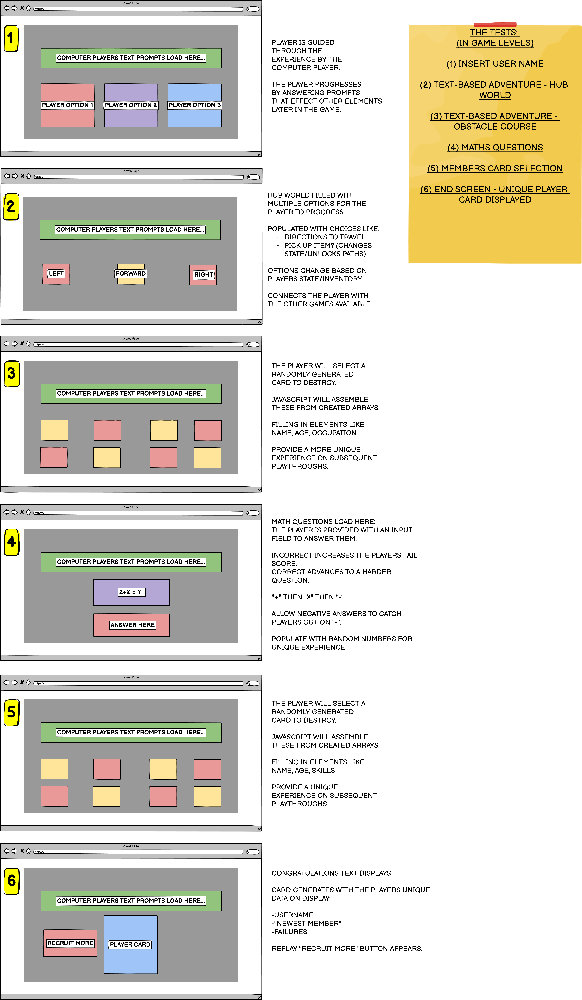</details>

<details><summary>Text Adventure Layout Wireframe</summary>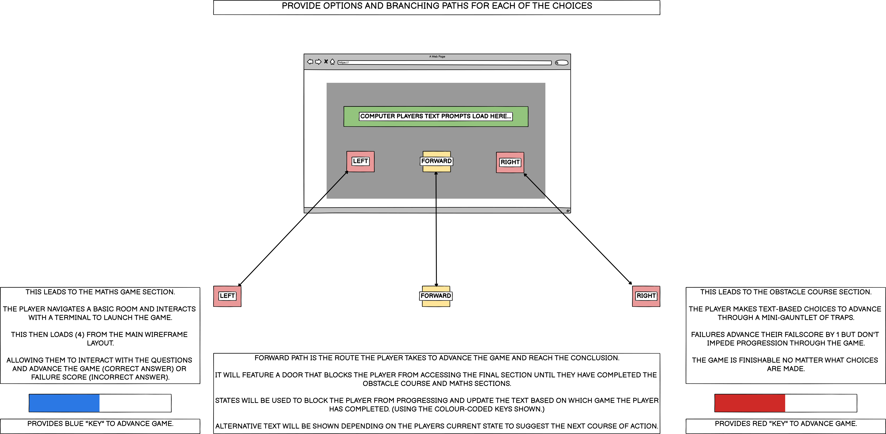</details>

^ This provides a more detailed layout of the H.U.G. HUB world the player will navigate. Explaining how player progression works. 

[Back to top ↑](#the-oversights---band-website)

---
## Surface Plane
---

In the following sections, I will describe how the game creates a positive experience for users through its use of hover effects, predictable navigation, clear content, and minimalistic design choices.

**Design Philosophies**
---

Bootstrap containers were utilised to ensure images and text would be readable across all devices, ensuring a consistent user experience for both mobile and desktop screens.

The only major change implemented between the mobile and desktop experience is the number of cards displayed on a single line in the end array section.

- Rows of 4 on large desktop devices.

<details><summary>Cards Large</summary>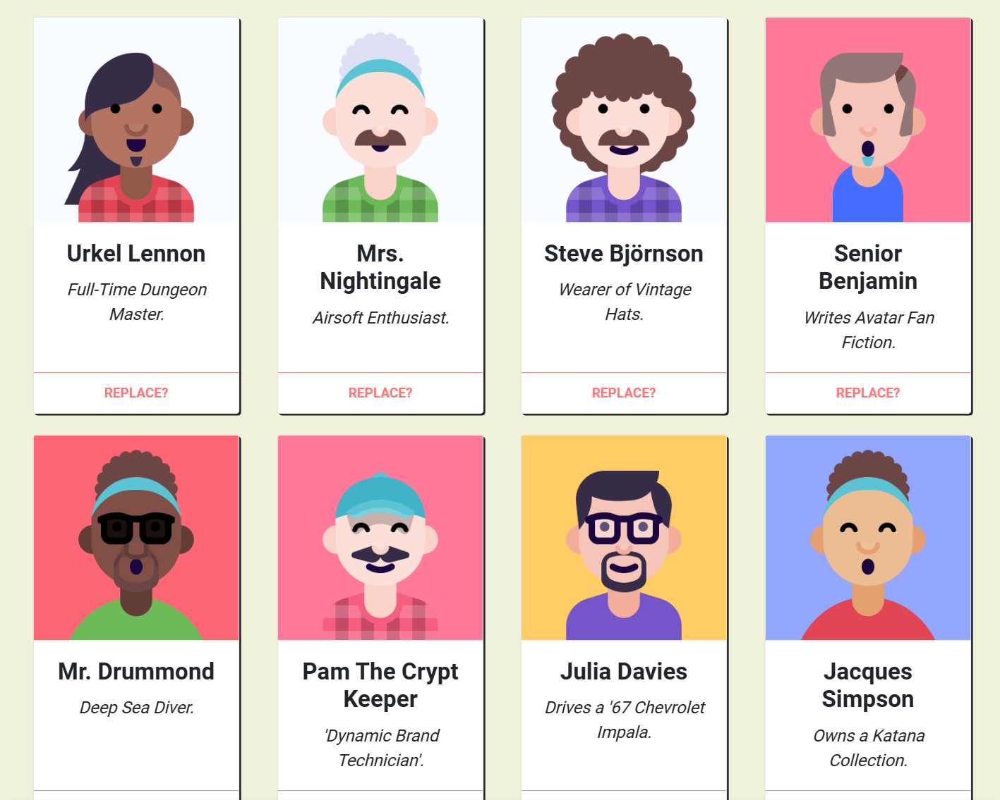</details>

- Rows of 3 on medium-sized devices.

<details><summary>Cards Medium</summary>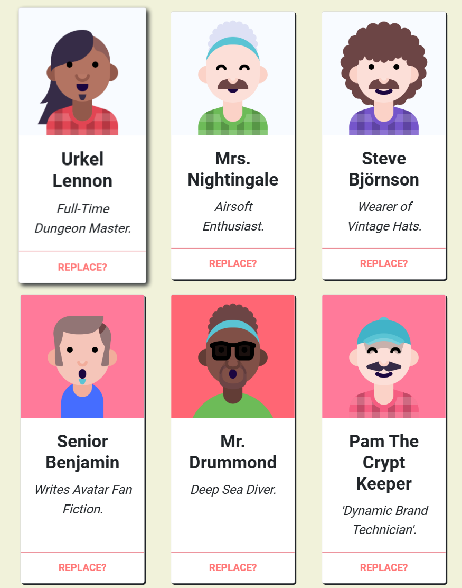</details>

- Rows of 2 on smaller-sized devices.

<details><summary>Cards Small</summary>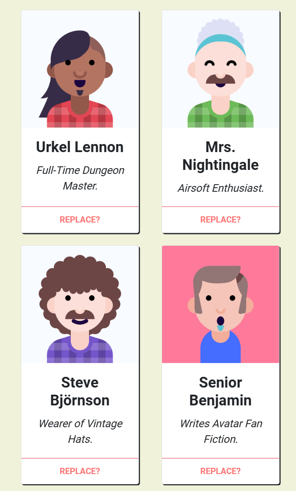</details>

- Rows of 1 on extra-small devices.

<details><summary>Cards X-Small</summary>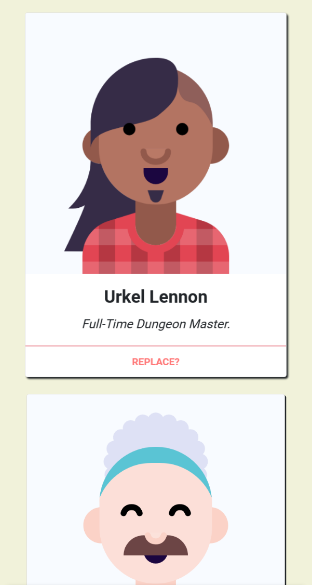</details>

---

During the Skeleton Plane, I explained how the user experience would be improved by the interaction design of the card and button elements.

I have documented images below to provide visual examples of each and confirmation that they have been implemented into the final design:

<details><summary>Card Hover</summary>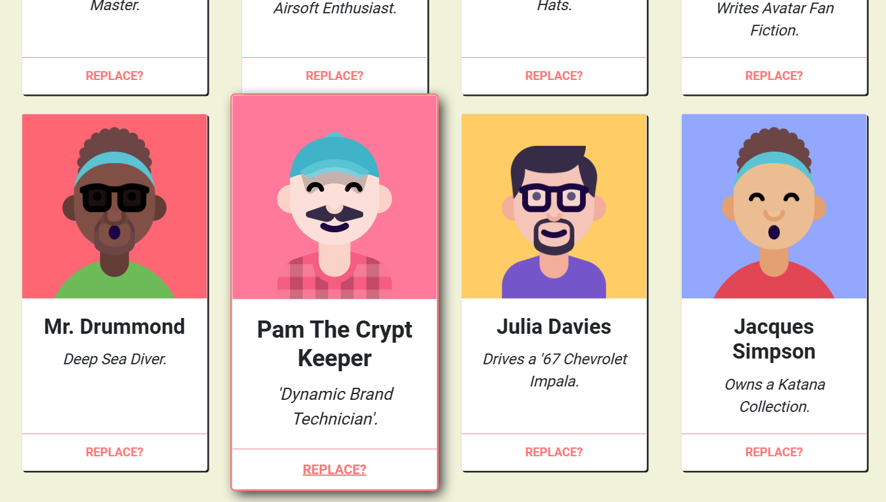</details>

<details><summary>Card Encouragement</summary>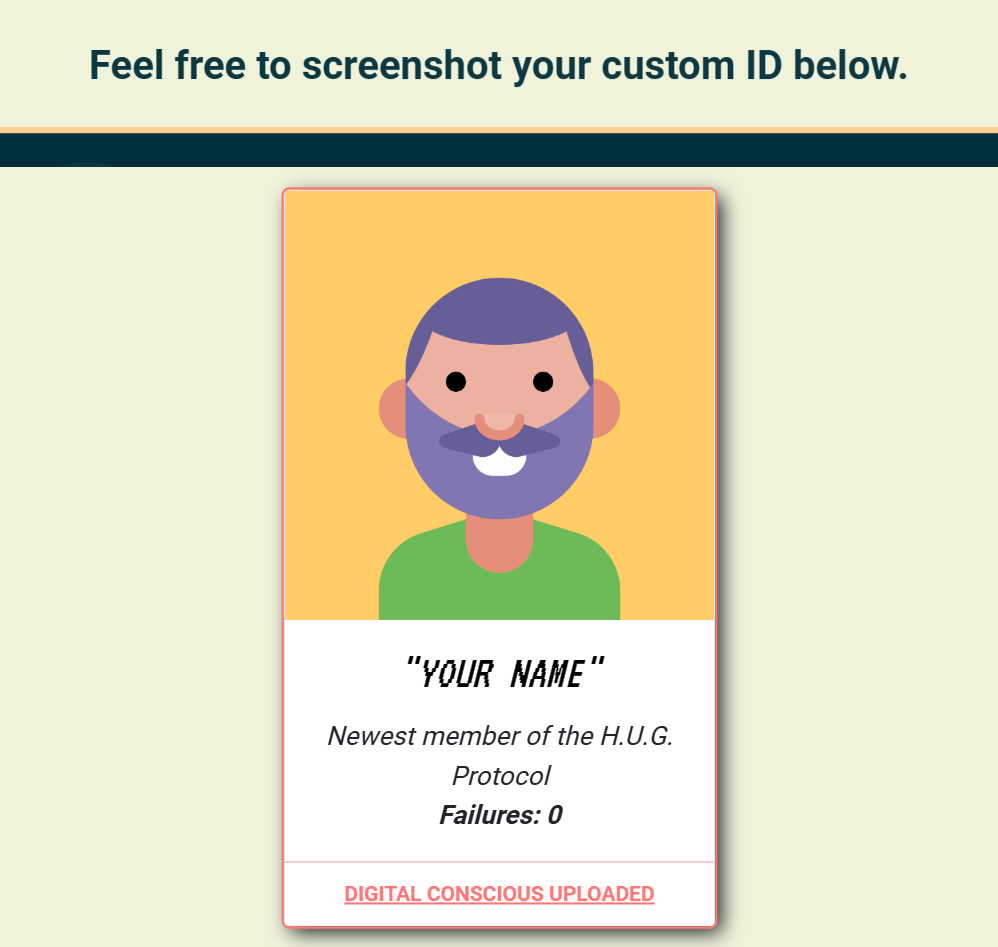</details>

<details><summary>Card Destruction</summary>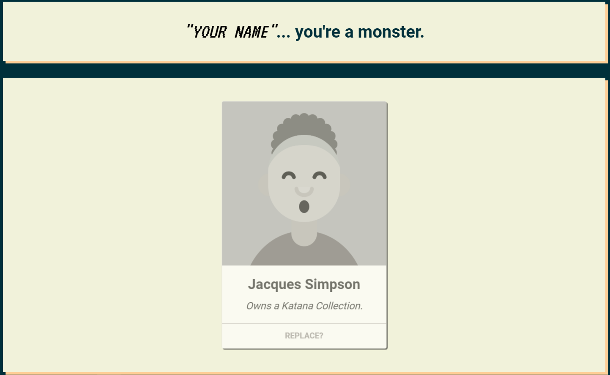</details>

<details><summary>Card Victory</summary>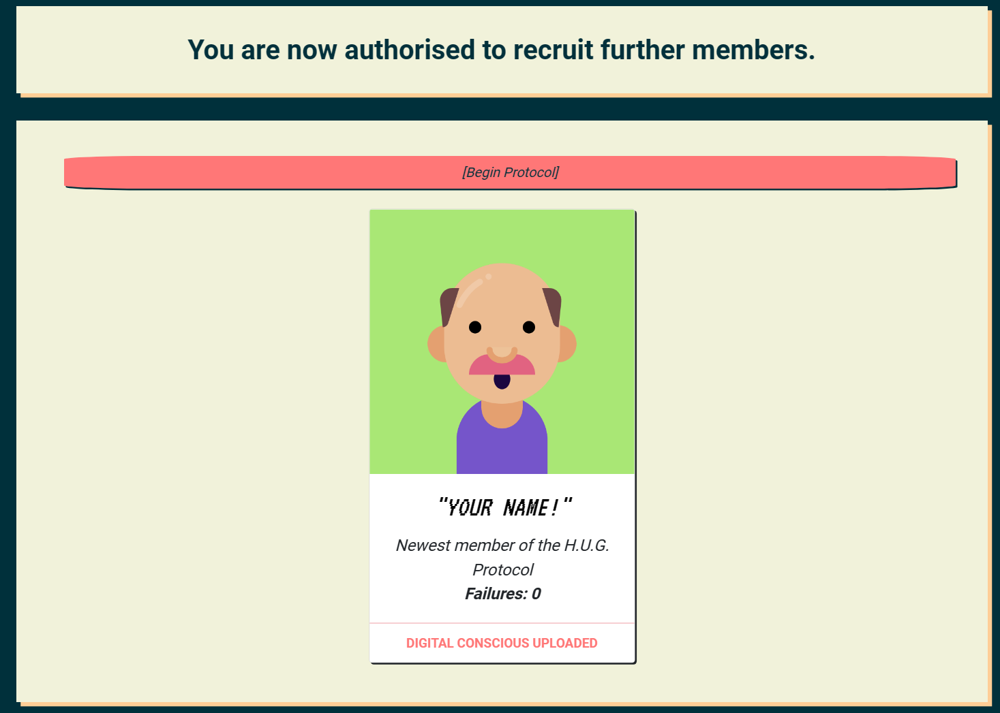</details>

---

For the button I added a subtle text underline and drop shadow, along with lifting the button slightly upwards, providing player feedback upon interaction without impacting the intentionally limited colour palette.

```
.btn:hover {
    text-decoration: underline;
    box-shadow: 5px 5px 5px;
    transform: translateY(-0.05em);
}
```
<details><summary>Standard Button Hover</summary>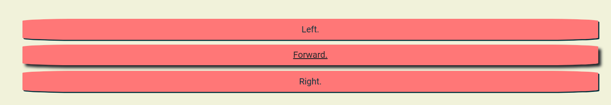</details>

---

The quit button at the bottom of the screen required a failsafe to prevent the user accidentally clicking it and restarting the entire game (as happened to me early during manual testing), as such I implemented an `onClick` function that displayed two additional buttons in it's place. Improving the users experience by preventing this disheartening action from happening and providing an additional check to confirm their action.

- One to confirm the Quit action.
- One to cancel the Quit action.

Feedback was provided by using default bootstrap classes to change the `:hover` colour of these buttons to Green and Red (`success` and `warning`).

<details><summary>Button Return</summary>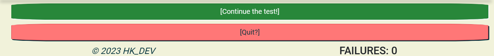</details>

<details><summary>Button Quit</summary>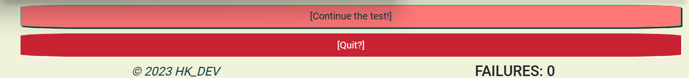</details>

---

**Visual Separation**
---

Visual separation is achieved between sections of the game through the use of bootstrap containers. 

The players area is alway

s displayed below the "Computer-Players" text box, sticking to an ordered hierarchy. At the bottom is a `Sticky Footer` which will maintain it's position responsively across all device screen sizes.

This simple layout, intuitively conveys the games structure to the user from the beginning.

Drop shadows were added to the top of the footer to provide a sleek sense of visual separation. This improves visual clarity between elements of the game and is crucial for the ending card section, where the second row of cards will be overlapped by the footer.

---

**Colour Palette**
---

The following colour palette was utilised throughout the game.

<details><summary>Colour Palette</summary></details>

It was taken from [Lospec: AYY4 PALETTE](https://lospec.com/palette-list/ayy4).

The reason I selected this palette was as a tribute to the simple text-based and Gameboy games of the past. These would often use highly limited, 4-colour palettes for their entire games. 

I wanted to emulate this limited style for a number of reason:

- To provide a sense of familiarity to the user. Who may have experienced a similar game in their past.
- To achieve a feeling of consistent, branded design throughout the projects many elements.
- To compliment the games narrative of navigating a Computer-hosted simulation environment.
- The colours compliment a simplistic design philosophy.
- They provide clean, distinct colours that pass best practice guidelines.

---

**Image Choices**
---

The game is devoid of imagery apart from the Avatar images that are used to populate the `members cards`.

[Personas](https://personas.draftbit.com/) was utilised to create the many avatar images.

The generator was user friendly and varied enough that I was able to generate 24 individual images for inclusion in this version of the game. In the future this can be increased to allow for even more variety.

This art style was selected as it was simplistic and complimented the overall design choices already made.

The layout of each card is as follows:
- First Name + Last Names (Create more unique combinations than just one name alone.)
- Special Skill (Included to add interest, humour and personality to each member.)
- A tag at the bottom of the card that reads `"Replace?"` to reinforce the action the user is about to take, providing further feedback to their interactions.

Below I have included a selection of "VICTORY" Cards from my play testers.

<details><summary>User #1</summary></details>

<details><summary>User #2</summary></details>

<details><summary>User #3</summary></details>

---

**Font / Typography**
---

It was important to me that the font was readable on all screen sizes while also representing the fact that it would be mainly used as the onscreen "voice" of the "Computer-Player". 

As such I stuck to [ROBOTO](https://fonts.google.com/specimen/Roboto) for the majority of the onscreen text.

In order to make the players `username` stand out from the text, I made use of the [VT323](https://fonts.google.com/specimen/VT323?query=vt) font by Peter Hull, which serves to visually emulate the classic computer monitor fonts of days passed. Visually this seemed like a natural choice to reinforce the "Computer-Player's" personality and visually highlight whenever the `username` was used to the player, improving their overall unique experience and connection to the games elements.

The selection of these fonts and the previous colour palette also helped in conforming to the expected culture of an old-school "text-based" adventure game. As many of these would have originally ran on older gaming systems like MS DOS or Commodore. 

---

**Dependencies**
---

Bootstrap and Jquery Javascript dependencies are placed at the bottom of the body tags. CSS dependencies are kept at the top. 

As this game is on a webpage it will be loaded "Top-Bottom" from the HTML file. 

This structure should ensure that the page is loaded quickly and that the user doesn't see an unstyled page or wait for the initial elements to load in. 

---
## Meeting User Stories
---

In this section, we shall revisit out original user & site-owner stories and examine if they have been met during the creation of this game.

    As a site user/game player, I want to:

    1. Be able to interact with the elements of the game and reach the desired result:

        1. Do the buttons work and direct you to an expected place?

        2. Can I enter a name in the `nameBox input` field and have it be displayed correctly throughout the project?

        3. Does the Maths answer box accept my answer and tell me if it's correct or incorrect?

        4. Do the options provided in the text-adventure section lead to logical areas?

**The above goal has been met** as evidenced - with imagery provided - in the below "Manual & User Testing" section. 

The game features all of the above mentioned elements:
- Username input box. Capable of accepting any symbols or numbers.
- Math answer input box. Displays the correct and incorrect answer responses as expected.
- Interactable buttons for navigation of the H.U.G. HUB, submitting requested data and restarting the game.
- All buttons direct you to the expected place as evidenced further in the "Manual & User Testing" section.

<details><summary>Username Input Box Testing - Before</summary>
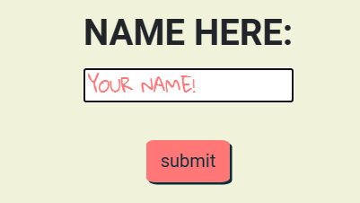</details>

<details><summary>Username Input Box Testing - After</summary>
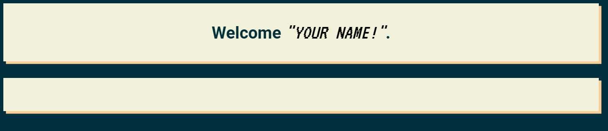</details>

<details><summary>Math Box - Correct</summary>
</details>

<details><summary>Math Box - Incorrect</summary>
</details>

    2. Reach a satisfying conclusion:

        1. Provide users with their own unique membership card.

        2. Grant users the ability to "recruit" others. Making them feel as if they've achieved true membership within the H.U.G. protocol.

**The above goal has been met.** 
The player is able to make it to the ending bug-free as evidenced in the following document sections. A unique membership card is generated for the user - as shown above where a sample of play-tester cards were shown. I've included further play-tester cards below, as immediate evidence.

The recruitment button is provided for players, encouraging them to share the game.

<details><summary>User #4</summary></details>

<details><summary>User #5</summary></details>

<details><summary>User #6</summary></details>

<details><summary>Recruitment Button</summary>
</details>

    3. Have a reason to replay the game:

        1. Is the user greeted with a different experience each time they play? If so how?
            
            1. through the use of randomly generated math questions
            
            2. through the use of randomly generated user cards
            
            3. different routes are available through the "Text-based" obstacle course section.

**The above goal has been met.** 
As already seen throughout this document, each maths question generates unique question on each playthrough of the game. The same is true for the user generated cards as evidenced in the last user goal section above and the manual testing section below.

There are a few varied routes on offer through the obstacle course, an image included in user testing - examining if player states have an impact on the game - shows proof of multiple options that only appear if the player collects the `rock` and `rope` objects.

I've included a few images to substantiate these claims further below.

<details><summary>Obstacle Course Choices</summary>
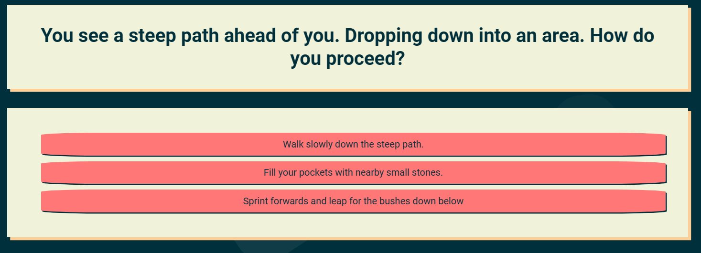</details>

<details><summary>Blast Door Monitor Choices</summary>
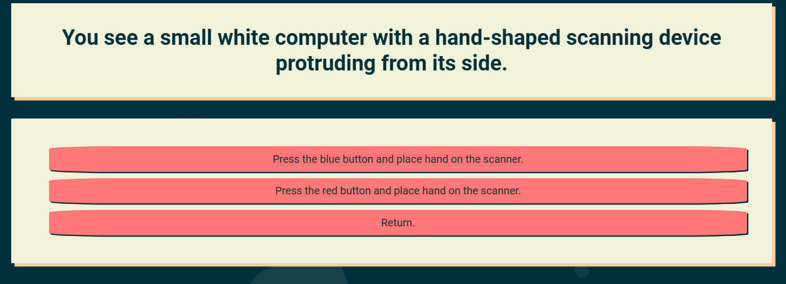</details>

<details><summary>HUB Navigation Choices</summary>
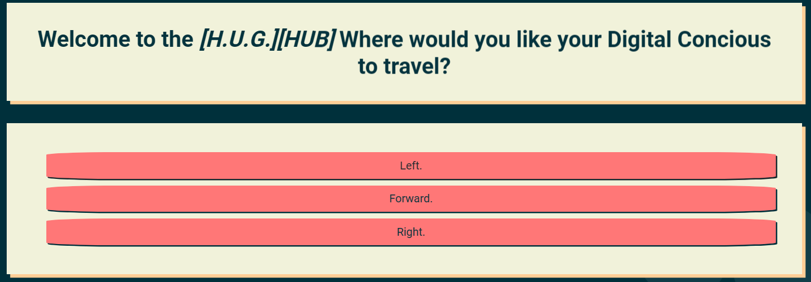</details>

    As a site owner, I want to:
    4. Ensure the app works as intended for the user.

    5. Ensure the user/player can interact with all elements to reach a logical and desired result.

        1. This goal will be achieved naturally by achieving all of the standards laid out within "User story" (1).
        
        2. Manual testing of the site's many paths and elements will be crucial to achieving both this goal and the aforementioned user goal, and as such will be documented in its own section later.

**The above goals have been met.** 
In the above user stories analysis and in the following testing sections, I have proven that the app and all of it's functions and features work as intended. Later in the document I have included the aforementioned Manual testing section. to provide further evidence.

    6. Ensure the app and its elements display correctly on any device.

        1. Check it on multiple devices and screen sizes. (Documented in the testing section and improved upon by user feedback).

        2. All elements can be interacted with by mouse and touch devices?

**The above goal has been met.** 
I personally tested the device on a number of devices including:
- Phones
- Tablets
- Laptops
- Desktop
During the development of this game. Further testing was carried out by play-testers made up of my friends, family and Code Institute forum members. These tests spanned numerous devices and browsers. Further documentation is provided in the testing section.

I have included images of touch functionality working on a mobile device below.

<details><summary>Touch Before</summary>
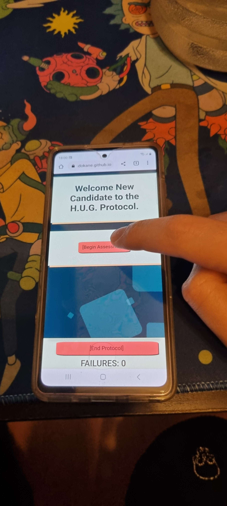</details>

<details><summary>Touch After</summary>
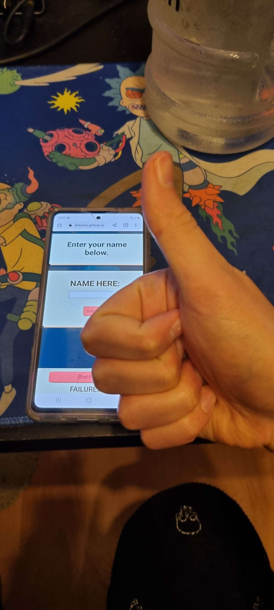</details>

    7. Demonstrate a variety of javascript functionality such as:

        1. "onClick" functions. (Button events).

        2. "promise" functions. (Sleep function).

        3. "if" loops. (To cycle through arrays and generate cards.)
        
        4. Arrays. (Members array stores data for card generation.)


**The above goal has been met.** 
The following Javascript functions are all used and viewable within this projects "scripts.js" file. This was important to include from a site-owner perspective in order to provide a varied game experience for the users and to meet the expectations of the assignment by providing a strong knowledge of Javascript.

- As an example of an "onClick" function here are lines (144-147):

```
    document.getElementById("startBtn").onclick = function () {
        // Removes nameBox from the "user" div inside of the html file
        startBtn.remove();
        enterName(); // runs enterName
```

- For an example of a promise function in action view this section of code from "scripts.js" lines (1171-1185):

```
 // Select one of the above sounds to play at random.
            async function delayedOutro() {
                game.text = "You actually did it...";
                updateText();
                await sleep(3000);
                game.text = `${username}... you're a monster.`;
                updateText();
                await sleep(3000);
                game.text = `Just kidding ${username}. Excellent work!`;
                updateText();
                await sleep(3000);
                // Loads the game ending.
                document.getElementById("sacrifice-card").removeChild(sacrifice);
                runEnding();
            };
            delayedOutro();
```

- An example of an "if/else" loop can be seen on lines (278-294):

```
    // Checks to see if the "nextText" ID matches a function. Then calls it.
    if (nextTextNodeId === -1) {
        // Removes questions buttons.
        while (document.getElementById("option-buttons").firstChild) {
            document.getElementById("option-buttons").removeChild(document.getElementById("option-buttons").firstChild)
        }
        // Loads the Maths Levels with the "levelIntroMath" function.
        levelIntroMath();

        // Checks to see if the "nextText" ID matches a function. Then calls it.
    } else if ((nextTextNodeId === -2)) {
        // Removes questions buttons.s
        while (document.getElementById("option-buttons").firstChild) {
            document.getElementById("option-buttons").removeChild(document.getElementById("option-buttons").firstChild)
        }
        // Loads the Final Card Level with the "finalProtocol" function.
        finalProtocol();
```

- The best example of an array is the "membership" array beginning on line (1068). 
Small - edited - segment included:

```
let members = {
    firstname: ["Jim", "Pam", "Steve", "Urkel",]
    lastname: ["Stevenson", "Björnson", "Lennon",]
    skill: ["Full-Time Dungeon Master", "Weekend Dog Walker", "Middle School Teacher",]
     avatar: [
        "assets/images/avatar/av1.png",
        "assets/images/avatar/av2.png",]
```

8. Provide a unique experience for each individual user/player.
    
    1. This goal ties into the "user story" (3) of achieving "replayability".
    
    2. We can achieve both through the use of random cards and "branching" pathways in the text adventure section.

**The above goal has been met.** 
As addressed in user story (3), the project provides plenty of positive feedback and incentives for the player to replay the game, such as:

- Achieving a higher score to display on their end card.
- Wanting to play different Maths questions.
- Trying different routes through the Obstacle course.
- Wondering what would happen if they got the `red chip` before the `blue chip` or vice-versa.
- Was that `rock` useful for something else?
- I wonder what other membership cards I can chose from on during the `final protocol`?

The random generators all work as intended providing the expected experience for users.
This is evidenced further in the Manual Testing section below, as is the case with other goals being met above.

The project features:
- 24 potential First Names 
- 24 potential Last Names
- 24 potential Skills
- 24 potential Avatars.

Running the numbers through a probability calculator has revealed to me there are a total of:


**3,321,960 combinations** 
---
that can be generated during the `final protocol`. 

<details><summary>Possible Combinations</summary>
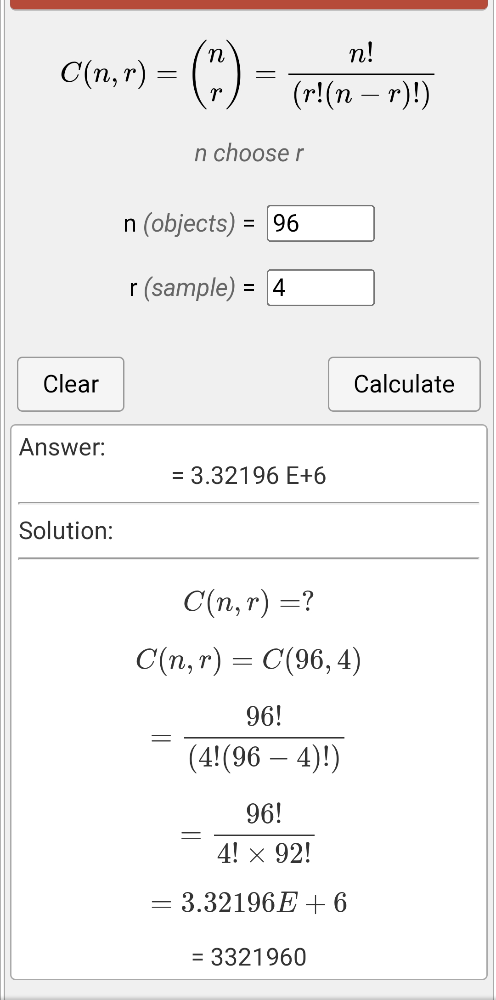</details>

With this I can confidently declare that the goal of providing the user with a **UNIQUE** experience has been met.

---

I am confident that the above examples further substantiate the evidence provided in the previous "Plane Analysis" sections and will be strengthened further by the following "Testing" sections. 

I have substantial reason to declare all user and site-owner stories met.

| STORY #      | GOAL          | (X IF) MET     |
| -------------|:-------------:|:-------------:|
| #1           | Interactive Elements Function As Expected          | X |
| #2           | Satisfying Conclusion Provided      | X |
| #3           | Reasons To Replay Present    | X |
| #4           | Ensure The App Works As User Expects     | X |
| #5           | Ensure Interactive Elements Lead To Logical Results    | X |
| #6           | Ensure The App Is Displayed Correctly On Multiple Devices    | X |
| #7           | Demonstrate A Variety Of Javascript Functionality Throughout  | X |
| #8           | Provide A Unique Experience For Each Individual Player | X |

[Back to top ↑](#The-H.U.G.-Protocol)

---

## Validation

---

With all user stories being satisfactorily met, the website being published and user-testing fixes implemented, the next step was to run the site through several online Validators to confirm it meets best practices and runs as efficiently as possible.

---
### HTML Validation
---

I began my validation by running the HTML page through "[W3C's Validation Service](https://validator.w3.org/)."

**Initial validation**

<details><summary>HTML Test</summary>

</details>

The errors found can be summarised as follows:
- Unnecessary /> closing tags on a few HTML Head links.
- An unnecessary type attribute had been included where i'd linked to my Javascript at the end of the HTML's body.

**Validation Passes**

I fixed the above issues and ran the pages back through W3C's validation services. 

<details><summary>HTML Pass</summary>

</details>

---
### CSS Validation
---

Next I carried out validation on the project's CSS file by running the page through "[W3C CSS Validation Service](https://jigsaw.w3.org/css-validator/)."

<details><summary>CSS Pass</summary>
</details>

The results came back successfully, allowing me to continue automated testing and validation.

---
### Javascript Validation
---

Finally it was time to run the largest, most integral file of this project - scripts.js - through "[JSLint](https://www.jslint.com/)."

**Initial validation**

<details><summary>Javascript Test (A)</summary>

</details>

<details><summary>Javascript Test (B)</summary>

</details>

I was initially horrified to see there were "138" warnings present. I poured a strong coffee and prepared for a long night... until i realised that I had mistakenly not clicked a few necessary options in JSLint.

Thankfully it turned out that the bulk of these warning (legitimately around ~133) were to do entirely with the following things:
- Unnecessary whitespace after comments.
- Comments running over 80 characters.

Ticking the options for "long" and "white" in the linters options, immediately cleared the bulk of these. Although I still did remove all unnecessary whitespace manually before moving onto the more realistic improvements offered, such as:
- Moving global variables to the top of the document.
- Changing a few "let" globals into "var" globals.

**Validation Passes**

After these quick changes, I re-ran the code and received the following result.

<details><summary>Javascript Pass</summary>

</details>

I opted to leave in the ";" at the end of my functions as an added precaution. My additional reading on the subject suggested that most developers are perfectly content to have them included in a project and they will in no way negatively impact the results of the site.

[Back to top ↑](#the-hug-protocol)

---
## Testing
---

### Wave Contrast & Accessibility
---

Next I ran the site through [WAVE's Accessibility Evaluator](https://wave.webaim.org/) to test for any issues with contrast or accessibility that may impede the users enjoyment of the game.

**Initial Test**

<details><summary>Wave Test</summary>
</details>

<details><summary>Wave Contrast Test</summary>
</details>

Wave returned favourable results in reference to my chosen colour palette. Ensuring all the text being displayed to the user will be visible and positively impact their experience while playing the game.

The only suggested improvement was to include a `<h1>` and `<h3>` tags as the page technically skips these on the initial screen.

As the game loads in and out text constantly and doesn't I didn't feel it was apt to set this as a `<h1>` tag as their is no "Title" present on the page at any point during a game session.

The `<h3>` tags also populate the game later on and are featured within the generated cards, meaning that at point in the game there are no structural issues. This seems worth noting and in future improvements I may consider adding in an introductory screen that can include these elements permanently. 

---
### Performance Testing
---

Google Lighthouse - a feature of Chrome Developer Tools - allows me to test the overall performance of the page on both mobile and desktop devices.

- It reminded me to add `<meta>` descriptions to my index head.

Featured below are the screenshots confirming my results:

**Desktop**

<details><summary>Lighthouse Results</summary>
</details>

---

**Mobile**

<details><summary>Lighthouse Index Mobile Results</summary>
</details>

---
### Device Testing
---

The website was tested and functioned as expected on the following devices:

- Novatech LTD. AMD Ryzen 7 3800x, 32GB Desktop
- Lenovo IdeaPad 5 Pro
- Samsung Galaxy S20 & S21
- Samsung Galaxy Tab S7
- MacBook Air with M1 chip
- iPhone 11, 13 & 14
- iPad Air
- Samsung Chrome Book

The website has been tested on up-to-date versions of the following browsers:

- Microsoft Edge
- Google Chrome
- Chrome for android
- Mozilla Firefox
- Opera
- Safari
- Internet Explorer

The website has also been tested on monitors of 16:9, 16:10 and 21:9 resolutions.

[Back to top ↑](#The-H.U.G.-Protocol)

---
## Manual & User Testing
---

Manual testing played a crucial role in the development of this game. It was present at nearly every step of development with me tracking how each function worked and interconnected - by text document or pen and paper - to ensure their would be no dead ends that effected the users experience and defined goals.

Once the project had reached completion I compiled a list of my main concerns for running play-testing.

The following would need to all be checked thoroughly and work without error, in order for me to feel i'd met my previously outlined Site Owner Goals. 

The following would need to be tested to ensure i'd satisfied my brief and provided a fully functional game, fit for consumption by the user:

(I have included an image or description proving the testing below each.)

---
1. Can the game be finished without encountering errors?

**Passes Testing:** Yes, i've tested the game numerous times since publishing and haven't ran into a single game-breaking or progression-preventing bug. My play-testers also never encountered an issue, meaning the game has been ran over 20x on at least 10 different devices without encountering a single issue.

(Further information on the devices used and play-testing discoveries is documented in their relevant sections.)

---

2. Will using non-standard letters break the user-name input?
    - Can you still finish the game like this?

**Passes Testing:** I've ran the game with numerous symbols and numbers in the name and not encountered a single issue with this impeding progress or displaying incorrectly when called by functions.

<details><summary>Username Input Testing #1</summary>
</details>

<details><summary>Username Input Testing #2</summary>
</details>

---

3. Does "GAME OVER" trigger correctly?
    - Can you trigger a "GAME OVER" from each question within the Maths section?
    - Can you trigger a "GAME OVER" from each bad answer in the Obstacle Course Section?

**Passes Testing:** I attempted to fail the game from each point within the Obstacle course and from within each equation round of the Maths game. It triggered successfully in each instance, preventing further gameplay without restarting.

<details><summary>GAME OVER Testing #1</summary>
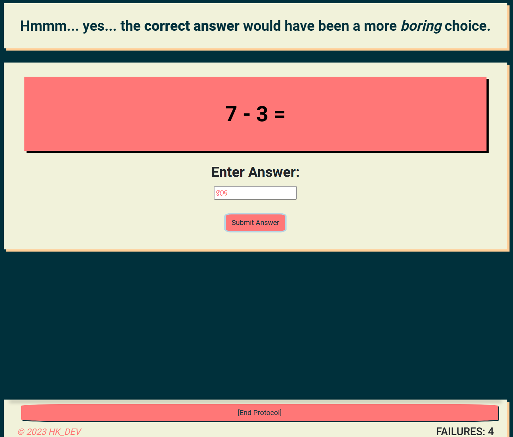</details>

<details><summary>GAME OVER Testing #2</summary>
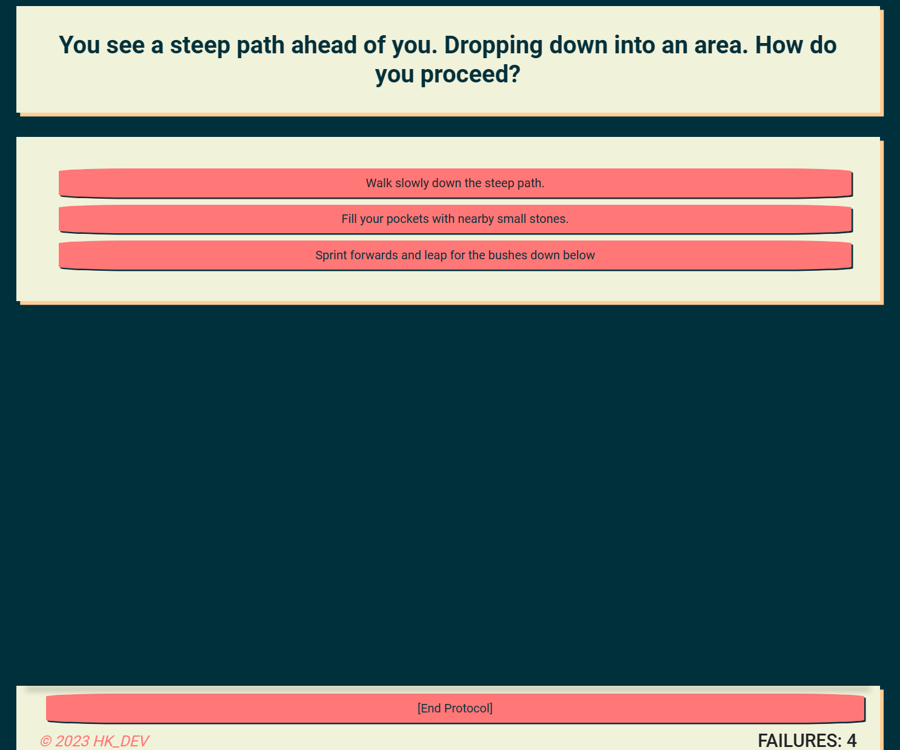</details>

<details><summary>GAME OVER Testing #3</summary>
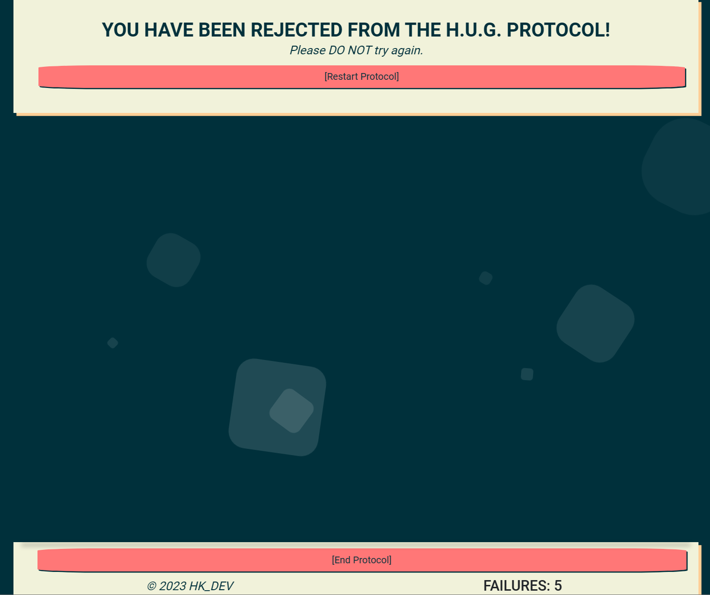</details>

---

4. Do different "members" appear each time this screen is reached by the player?
    - Are their first names, last names and skills different enough on each reload?
    
**Passes Testing:** Documented three instances of this section of the game below. Different first name and last name parings and skills were shown.
    
<details><summary>Card Randomiser #1</summary>
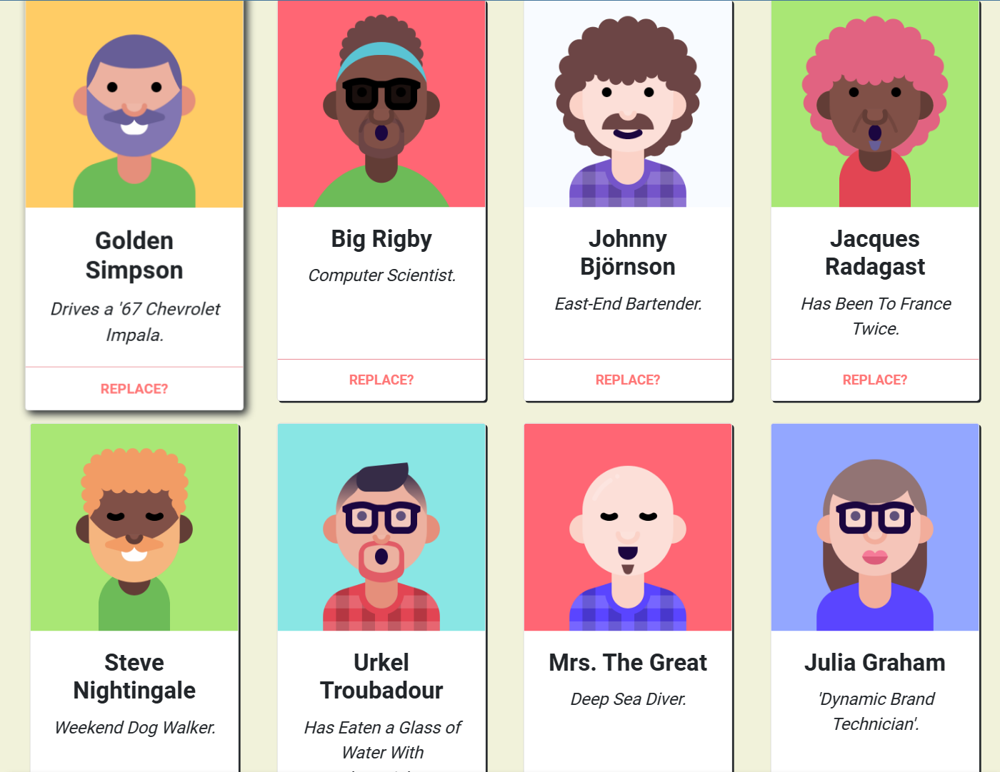</details>

<details><summary>Card Randomiser #2</summary>
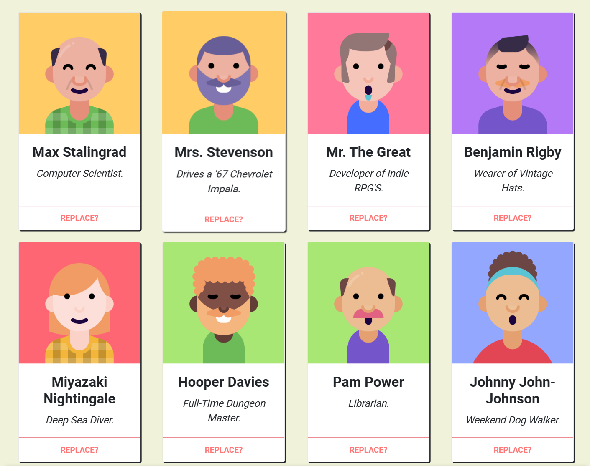</details>

<details><summary>Card Randomiser #3</summary>
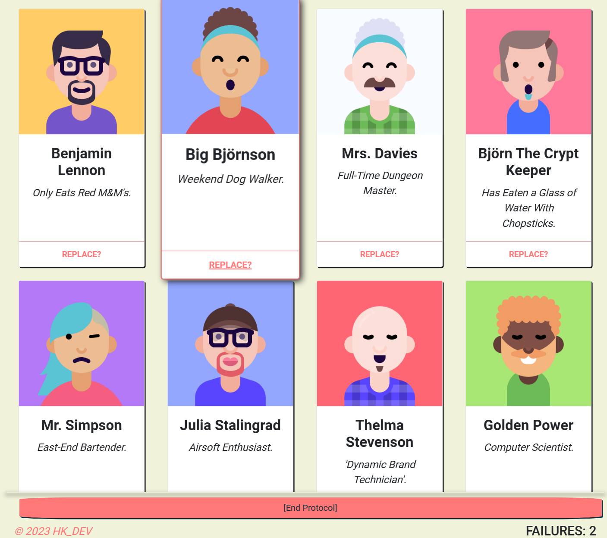</details>

---

5. Does the players end card display?
    - Does their score match their failures?
    - Does their username match?

**Issue Discovered:** An issue for this was uncovered during user testing. The card displayed incorrectly on small-screened devices. This has been fixed and is discussed within the User Feedback section below.

**Passes Testing:** On all instances of game completion the `failScore` displayed in the footer matched the `FAILURES:(score)` printed on the players card. The `username` also matched in each case of game completion.
     
<details><summary>Fail Score Test</summary>
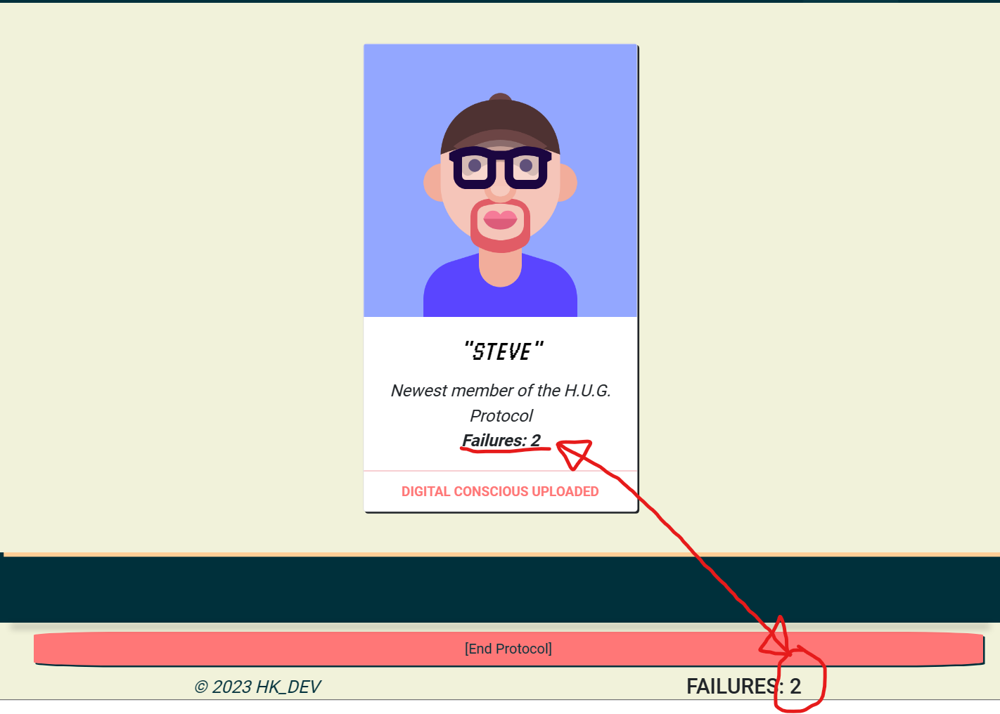</details>

---

6. Do the math questions accept the correct answers?
    - Do they correctly update to, and display, the next operand?

**Passes Testing:** Correct and Incorrect answers are responded to. If the answer is correct, the game loads the next operand and continues until all three questions have been answered. Otherwise it replays the same operand's questions, adding to the failures of the player and calling a Game Over as tested in Question (3) above.
     
<details><summary>Maths Input Tests - Correct - Before Click</summary>
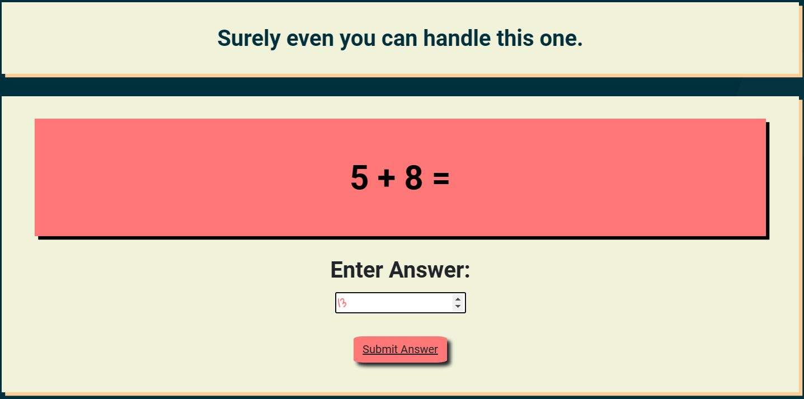</details>

<details><summary>Maths Input Tests - Correct - After Click</summary>
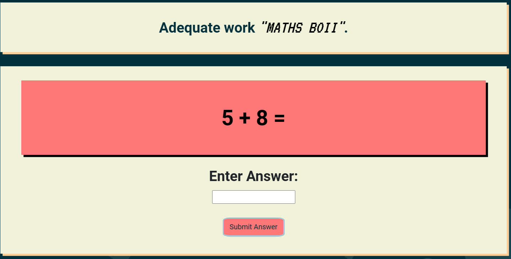</details>

<details><summary>Maths Input Tests - Incorrect</summary>
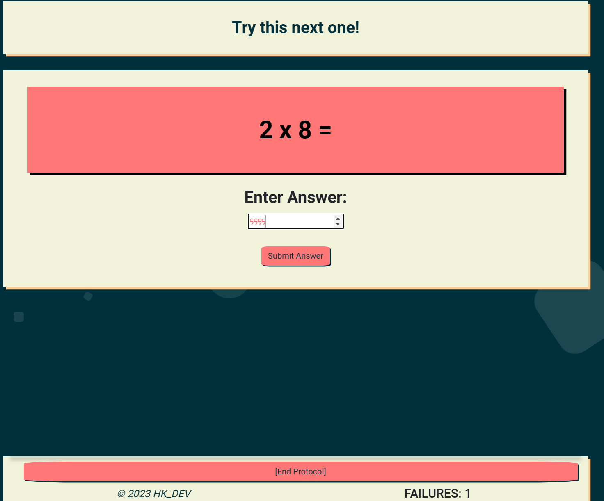</details>

<details><summary>Maths Input Tests - Incorrect</summary>
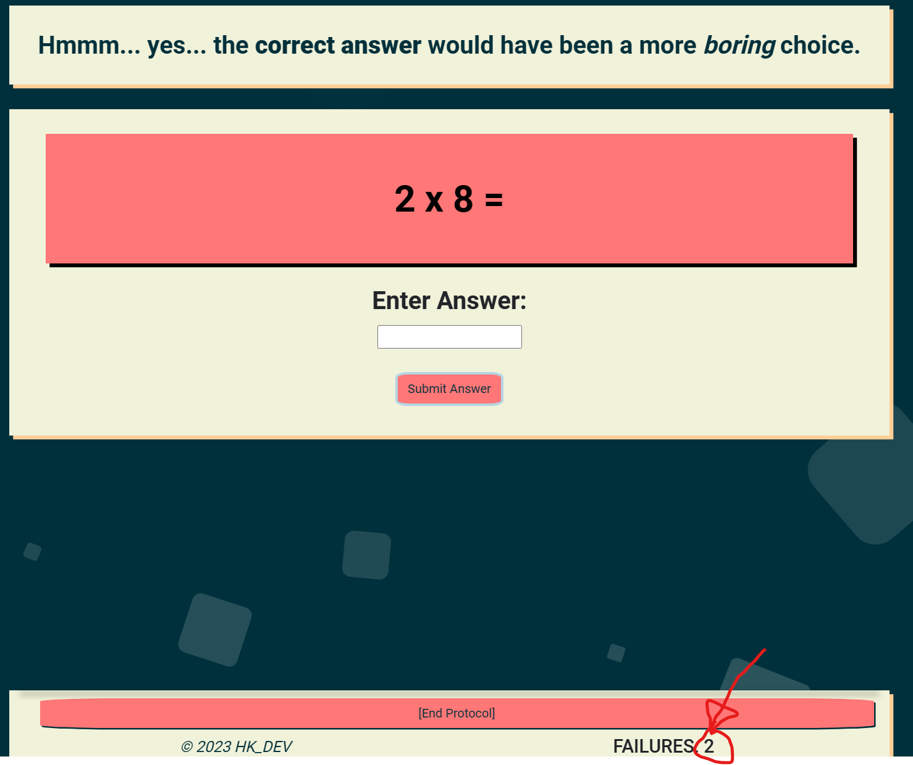</details>

---

7. Do the correct options display in the Obstacle course section based on the `state{}`?
    - Does keeping a state such as `"rock: true" or "rope:true"` effect the game when kept longer than intended?   
    - Can you still finish the game with these set to `true`? 

**Passes Testing:** I was able to complete the game no matter what additional states I had `:true` or `:false`. They didn't prevent progression as long as the correct states were active. The image below is an example from a round where I left both the `rock` and `rope` set to `:true` and was still able to finish the game without issue.

<details><summary>State Change Checking</summary>
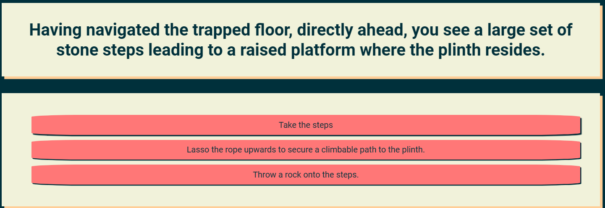</details>

[Back to top ↑](#The-H.U.G.-Protocol)

---
### User Feedback
---

Extensive user testing was carried out by friends, family and Slack forum members. Thanks to this external testing I was able to discover and fix two additional issues.

1. The Maths Answer Box didn't empty out the previous answer when the questions advanced, meaning the user had to manually do this themselves when entering the next answer, providing a poor experience.

I solved the issue by adding this additional line of code to the `function checkAnswer(){...}`. So that each time the answer is checked, the input box is cleared, ready for the users next input. Vastly improving the users experience when interacting with this element.

```
// Clears text from the answer box.
document.getElementById("answer-box").value = "";
```

2. The final users card was displaying incorrectly on small screened devices. The image was very squashed and hard to read, which was not the intention. It also wasn't filling much of it's `<div>` container.

<details><summary>The Broken Card Image</summary>
</details>

This displayed the image fine on larger screens but I hadn't factored in that the container was smaller on smaller devices and therefore the card displaying at 40% it's maximum scale wouldn't look good, or maintain it's shape as the screen size decreased.

<details><summary>The ".build" class</summary>
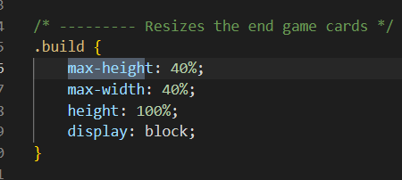</details>

I fixed this issue by implementing bootstrap containers and removing the custom ".build" css class I had set up. This was setting the card to 40% of the container size. 

<details><summary>The code that replaced ".build"</summary>
</details>

<details><summary>The Fixed Card Image</summary>
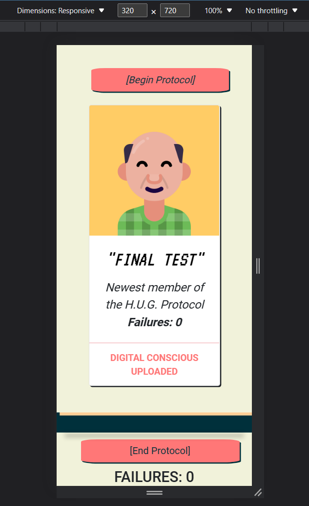</details>

I discovered this issue with the ".build" class after testing the project with the use of Chrome Dev Tools.

<details><summary>Chrome Dev Tools Example</summary>
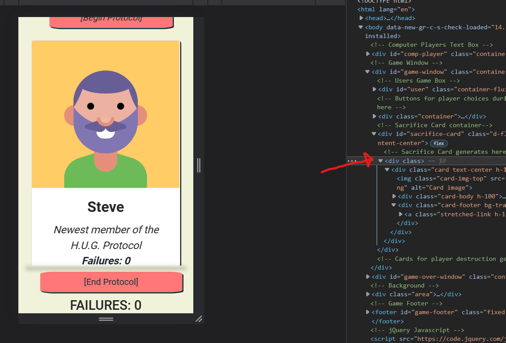</details>

[Back to top ↑](#The-H.U.G.-Protocol)

---
### Chrome Dev Tools
---

Chrome Dev Tools served as one of my most important methods of debugging from start to finish. It allowed me to find numerous errors in the code such as: 
- noticing discrepancies in my `<div>` arrangements and classes that affected the styles and overall final alignment of generated elements such as the members cards.
- test out inline style's on numerous elements before typing those up in CSS or Javascript for use.
- see if an object had unintentional padding or margins being applied to it by Bootstrap or other external classes.
- diagnose numerous bugs and hierarchical code issues present throughout the project.
- use the "issues" tab to see any other ongoing problems that - even if not preventing the game from running - may not meet best practice guidelines.

<details><summary>Chrome Dev Tools #1</summary>
</details>

<details><summary>Chrome Dev Tools #2</summary>
</details>

<details><summary>Chrome Dev Tools #3</summary>
</details>

This is detailed further throughout the below Bug Fixes section (#4, #6, #7 - serving as prime examples.)

[Back to top ↑](#The-H.U.G.-Protocol)

---
## Bug Fixes
---

The following is a documentation of the bugs encountered throughout the development process of this "Text Adventure" Game.

---

**BUG #1**

---

The computer player's text would update to the last line automatically before the user was given the chance to see the previous lines. 
<details><summary>Bug #1-1</summary>
</details>
This happened because functions don't happen asynchronously by default.

My solution was found online in a [Sitepoint article](https://www.sitepoint.com/delay-sleep-pause-wait/) which showed me I could use an async promise function to create a reusable automated delay between text updates.
<details><summary>Bug #1-2</summary>
</details>

This allowed me to achieve my vision of providing an automated AI computer to act as the player's guide throughout the game.
<details><summary>Bug #1-3</summary>
</details>

---

**BUG #2**

---

I wanted to be able to style the player's username to differentiate it from the computer player's text.

By passing the "userText" value, I found I was unable to remotely change it.
<details><summary>Bug #2-1</summary>
</details>
The solution I engineered was to change the:

```
cText.innerText = game.text;
into 
cText.innerHTML = game.text;
```
By changing the above to `.innerHTML` I was able to provide classes and styling to the username value without having to worry about altering the surrounding text.
<details><summary>Bug #2-2</summary>
</details>

---

**BUG #3**

---

I tried following an online tutorial - [Youtube: developedbyed](https://www.youtube.com/watch?v=GUEB9FogoP8) - to separate the characters within "game.text" to get them to animate individually.
<details><summary>Bug #3</summary>
</details>

The following lines of code didn't work as expected and the text simply animated on as normal.

```
cont span = document.getElementsByClassName("fancy")[char];
$(span).addClass("noOpacity");
```
I eventually decided to simply use the "Animate.css" plugin to animate the text in a satisfying manner.

This is something I would look at reintroducing in a future version of the game.
At this stage however, it wasn't a core feature for the user experience and was cut from this stage of development.

---

**BUG #4**

---

Answers input into the "Maths" game section were being flagged as incorrect, even when correct.

<details><summary>Bug #4-1</summary>
</details>

To investigate this further I utilised Chrome Dev Tools.

I began by console logging out the values and data types of the random numbers being generated for the math equations, the operand used and the user's answer.

<details><summary>Bug #4-2</summary>
</details>

This allowed me to uncover that I had been comparing a number to a string value using `===` which would return a false answer even when the values matched. 

As a "9" number isn't equivalent to a "9" that is a string.

<details><summary>Bug #4-3</summary>
</details>

Removing the `parseINT()` from around the following:

```
let operator = parseInt(document.getElementById(operator));
```

This caused the operator to return the correct type of data, allowing the equation to return true when the correct answer was input.

---

**BUG #5**

---

I designed the game's many different levels in individual segments and functions. This was to ensure they worked in isolation before joining them all together.

As I connected the new game launch button with the name input field, I encountered an error where the text box for the player to enter their chosen username wouldn't appear.

<details><summary>Bug #5-1 (BEFORE CLICK)</summary>
</details>

<details><summary>Bug #5-2(AFTER CLICK)</summary>
</details>

After some analysis, I found this code to be the culprit.

<details><summary>Bug #5-3</summary>
</details>

Removing the new game button directly from the div itself, seemed to stop the amend that was called in the next function.

The solution in this instance was to instead remove the button directly.

<details><summary>Bug #5-4</summary>
</details>

---

**BUG #6**

---

Clicking the "nameBox" submit button, removed the entire div element it was inside of.

<details><summary>Bug #6-1 (BEFORE CLICK)</summary>
</details>

<details><summary>Bug #6-2 (AFTER CLICK)</summary>
</details>

This was caused by and resolved similarly to Bug #7.
The remove function called on "nameBox" was removing the entire "user" div, meaning the amend couldn't create the following object in its target div, as it had been deleted.

<details><summary>Bug #6-3</summary>
</details>

The solution was to again simply remove the "nameBox" directly.

<details><summary>Bug #6-4</summary>
</details>

---

**BUG #7**

---

The card generator array would stop splicing people from the "members" array. Occurring before the function had finished being called for the 8th time.

<details><summary>Bug #7-1</summary>
</details>

It seemed randomised how many were created before the loop would stick to the same number and stop producing results.

<details><summary>Bug #7-2</summary>
</details>

The solution was to move the random number generator variables inside of the loop, as they weren't being called correctly when left as global variables.

<details><summary>Bug #7-3</summary>
</details>

---

**BUG #8**

---

A further issue with the array was when the cards wouldn't generate a random avatar image despite being - seemingly - correctly coded.

<details><summary>Bug #8-1</summary>
</details>

I had forgotten to add the ".png" suffix to the end of my linked avatar images within the array.

After amending these suffixes the cards loaded as expected.

<details><summary>Bug #8-2</summary>
</details>

---

**BUG #9**

---

Text animations weren't playing during the "HUB Text Adventure" portion of the game.

This caused a jarring experience for the user as the text would stop animating during this section only.

The issues lie in the code I had written to set the: 

```
cText.innerHTML = <h2>textNode.text</h2>
```

This seemed logical to me as the "cText" was the element being displayed, formatted and working correctly in other areas of the game.

However the code that got me the desired result was:

```
game.text = textNode.text;
updateText();
```

The animations themselves had been tied to the `updateText()` function, which was not being called with the original code.

This change fixed the bug and allowed the game to maintain its animations throughout, improving the user's experience by preventing a distracting change.

---

**BUG #10**

---

Originally had card set to `scale: 95%` in order to separate them vertically, as setting their bodies to `h-100` meant their was no gap between the tops and bottoms of each individual card. After passing this through stages of automated validation, I was advised to change the setting to `transform: scale(0.95)` in my CSS. This change didn't effect functionality but is a more correct way to write this style.

<details><summary>Bug #10-1</summary>
</details>

[Back to top ↑](#The-H.U.G.-Protocol)

---
## Deployment
---

The website was deployed on GitHub via the following steps:

1. Login into GitHub and navigate to this repository - [CI_PP2_H.U.G.](https://github.com/Hadokane/CI_PP2_HUG)
    <details><summary>Deployment 1</summary></details>
2. Head to the "Settings" tab on the navigation menu and select it.
3. On the left sidebar select "Pages".
    <details><summary>Deployment 2</summary></details>
4. Under "Build and deployment" you will see a heading names "Source". Click on the dropdown menu and select: "Branch: main" leaving the file as "/(root)"
5. Click the save button.
    <details><summary>Deployment 3</summary></details>
6. A URL will appear in your newly deployed repository.
7. GitHub will process your request and the bar's colour will change from blue to green on a page refresh, indicating that the page has been deployed.
8. The website is now live and deployed at the following URL: https://hadokane.github.io/CI_PP2_HUG/


**Forking**
1. Login into GitHub and navigate to this repository - [CI_PP2_H.U.G.](https://github.com/Hadokane/CI_PP2_HUG)
2. Select the "Fork" tab on the right-hand side of the navigation menu.
3. Choose a destination to save your newly forked repository.


[Back to top ↑](#The-H.U.G.-Protocol)

---
## Credits 
---

### Languages Used

- HTML 5
- CSS 3
- Javascript ES2022

### Frameworks Used 

- [Bootstrap 4](https://getbootstrap.com/docs/4.6/getting-started/introduction/) - For their responsive grid and container system.
- [jQuery](https://jquery.com/download/) - For their convenient JavaScript library features.
- [Animate.css](https://animate.style/) - For their simple to use CSS animations.

### Validators Used 

- [W3C HTML Validator](https://validator.w3.org/) - Validation of HTML.
- [W3C JigSaw Validator](https://jigsaw.w3.org/css-validator/) - Validation of CSS.
- [JSLint Validator](https://www.jslint.com/) - Validation of Javascript.
- [Webaim](https://wave.webaim.org/) - Accessibility Testing.
- [Lighthouse & Chrome DevTools](https://developer.chrome.com/docs/devtools/) - Performance testing.

### Technologies Used

1. [CI TEMPLATE](https://github.com/Code-Institute-Org/gitpod-full-template) - This repository was initially created using Code Institute's provided template.

2. [Markdown Guide](https://www.markdownguide.org/cheat-sheet/) - For their "Markdown Cheat Sheet" and assistive documents on writing a README.md file.

3. [Grammarly](https://app.grammarly.com/) - For spell-checking my Text Based Adventure Module during brainstorming.

4. [Am I Responsive](https://ui.dev/amiresponsive) - For providing the mock-up image featured at the top of this document.

5. [Google Fonts](https://fonts.google.com/) - For access to their wealth of commercially-available fonts.

6. [Favicon.io](https://favicon.io/) - For providing an emoji based favicon for use in this game.

7. [Balsamiq](https://balsamiq.com/) - For providing software to create the wireframes seen in this README.

8. [GitHub](https://github.com/) - For serving as my IDE of choice and allowing me to create and deploy my repository for user testing and submission purposes.

9. [StackOverflow Question](https://stackoverflow.com/questions/11813806/javascript-get-a-functions-variables-value-within-another-function) - For advice on making functions global. Used when deciding if username variables should be made global for later content to access the value.

10. [FreeCodeCamp Article](https://www.freecodecamp.org/news/var-let-and-const-whats-the-difference/) - For a convenient primer on the differences between "Var" "Let" and "Const". Used when checking over my variables to ensure correct choices had been made.

11. [Sitepoint Article](https://www.sitepoint.com/delay-sleep-pause-wait/) - Explained the premise of a "sleep" function and the use of promises to stagger my code for the automated computer player box I implemented throughout the project. This allowed for the integration of a more user friendly experience by reducing the number of button presses required to progress for the user. Creating the illusion of a sentient AI presence.

12. [Youtube: developedbyed](https://www.youtube.com/watch?v=GUEB9FogoP8) - Great tutorial on text animations. Didn't end up implementing as used Animate.css instead but serves as good reference for potential future updates.

13. [CodeBoxx Article](https://code-boxx.com/allow-one-click-javascript/) - For reference when deciding to disable the "maths-box" submit button onClick to prevent multiple answer submissions. Could cause the score to bug out or the player to accidentally fail the game.

14. [MDN Webdocks](https://developer.mozilla.org/en-US/docs/Web/API/EventTarget/removeEventListener) - Provided general Javascript advice and reminders on functionality. Namely pertaining to event listeners and DOM targetting/navigation.

15. [Personas](https://personas.draftbit.com/) - Avatar generator used to provide images for the cards generated by the "members" array.

16. [Animate.css](https://animate.style/) - Animation plug-in used for text update animation.

17. [w3Schools](https://www.w3schools.com/) - Use for general HTML, CSS & Javascript research and referencing.

18. [CodePen Article](https://codepen.io/gunnarbittersmann/pen/XpqmgJ?editors=0100) - Provided a reference example of an image fading to grey. Used as reference when creating my own "Fade Out" Animation for the "sacrifice" Card.

19. [Valve: Left4Dead](https://www.youtube.com/watch?v=O8IJepb-hlQ) - Death sounds sampled to make the "destroy" card audio heard at the end of this game.

20. [DEV](https://dev.to/javascript_jeep/how-to-empty-the-dom-element-in-javascript-nf8)- Used to understand the best method to empty a div in Javascript.

21. [Lospec: AYY4 PALETTE](https://lospec.com/palette-list/ayy4) - Color palette I used for this project.

22. [SpeckyBoy](https://speckyboy.com/css-javascript-animated-backgrounds) - Animated background in project taken directly from here.

---
## Acknowledgements
---

With thanks to:
- My family and friends - For providing some great feedback and user-testing across multiple devices and browsers.

- Code Institute & their wider "Slack" community - For providing me with the necessary skills, knowledge and guidance to execute this project.

[Back to top ↑](#The-H.U.G.-Protocol)

---